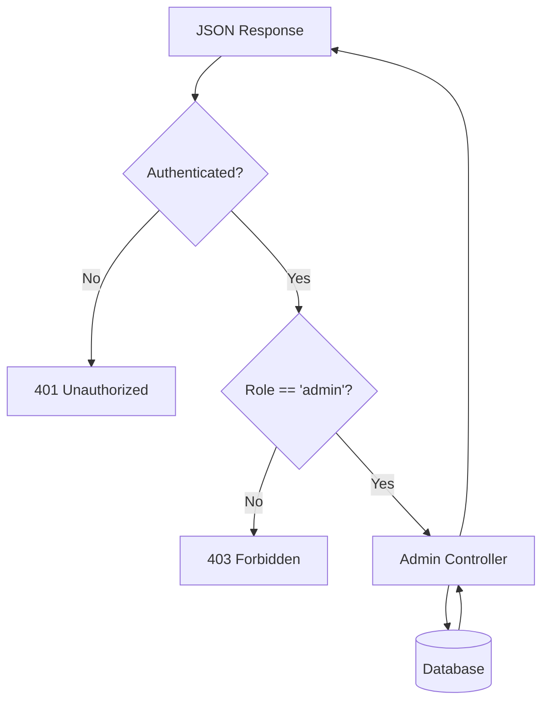

# Admin Module & Authorization Flow

## Table of Contents
1. [Overview](#overview)
2. [Authorization Strategy](#authorization-strategy)
3. [Database Schema Updates](#database-schema-updates)
4. [API Endpoints](#api-endpoints)
5. [Implementation Details](#implementation-details)
6. [Testing](#testing)

---

## Overview

Module **Admin** cung cấp các chức năng quản trị hệ thống, yêu cầu phân quyền (authorization) nghiêm ngặt. Chỉ những user có role là `admin` mới được truy cập các API này.

### Key Features

- ✅ **Role-based Access Control (RBAC)**: Phân quyền dựa trên role của user (`user` vs `admin`)
- ✅ **Dashboard Stats**: Xem thống kê tổng quan hệ thống
- ✅ **User Management**: Xem danh sách user, tìm kiếm, lọc theo role
- ✅ **Role Assignment**: Cấp quyền admin cho user khác

---

## Authorization Strategy

Chúng tôi sử dụng **Middleware Pattern** để kiểm tra quyền truy cập:

1.  **Authentication**: Xác thực identity của user (đăng nhập chưa? token hợp lệ không?).
2.  **Authorization**: Kiểm tra user có quyền truy cập resource không (role là gì?).

### Flow Diagram



---

## Database Schema Updates

### Users Table

Thêm trường `role` vào bảng `users`:

```sql
ALTER TABLE users ADD COLUMN role VARCHAR(20) DEFAULT 'user';
```

**Updated Model:** [User.js](file:///d:/STUDY/HUST/Subject/Web/hustudent/backend/models/User.js)

```javascript
role: {
  type: DataTypes.ENUM('user', 'admin'),
  defaultValue: 'user',
  allowNull: false
}
```

---

## API Endpoints

Tất cả các endpoints dưới đây đều yêu cầu xác thực qua **Cookie** (`token=...`) hoặc **Header** (`Authorization: Bearer <token>`). Yêu cầu quyền **Admin**.

### 1. Dashboard Statistics

-   **URL**: `/api/admin/stats`
-   **Method**: `GET`
-   **Desc**: Lấy số lượng users, groups, quizzes, sessions và danh sách user mới đăng ký.

**Response Example:**
```json
{
  "success": true,
  "data": {
    "counts": {
      "users": 150,
      "groups": 12,
      "sessions": 45,
      "quizzes": 30
    },
    "recentUsers": [ ... ]
  }
}
```

### 2. Get All Users

-   **URL**: `/api/admin/users`
-   **Method**: `GET`
-   **Query Params**:
    -   `page`: Số trang (default 1)
    -   `limit`: Số lượng/trang (default 10)
    -   `search`: Tìm theo tên hoặc email
    -   `role`: Lọc theo role (`user` | `admin`)
-   **Desc**: Quản lý danh sách người dùng.

**Response Example:**
```json
{
  "success": true,
  "data": {
    "users": [
      {
        "id": 1,
        "full_name": "Admin User",
        "email": "admin@example.com",
        "role": "admin",
        ...
      }
    ],
    "pagination": {
      "total": 150,
      "page": 1,
      "totalPages": 15
    }
  }
}
```

### 3. Update User Role

-   **URL**: `/api/admin/users/:userId/role`
-   **Method**: `PUT`
-   **Body**:
    ```json
    { "role": "admin" }
    ```
-   **Desc**: Thăng cấp hoặc hạ cấp quyền của user.

---

## Implementation Details

### 1. Authorization Middleware

**File:** [auth.js](file:///d:/STUDY/HUST/Subject/Web/hustudent/backend/middleware/auth.js)

```javascript
export const authorize = (...roles) => {
  return (req, res, next) => {
    // 1. Check if user is authenticated (set by previous middleware)
    if (!req.user) {
        return res.status(401).json({ error: 'User not authenticated' });
    }

    // 2. Check if user's role is in the allowed list
    if (!roles.includes(req.user.role)) {
      return res.status(403).json({
        error: `User role ${req.user.role} is not authorized`
      });
    }
    
    // 3. Proceed
    next();
  };
};
```

### 2. Route Protection

**File:** [adminRoutes.js](file:///d:/STUDY/HUST/Subject/Web/hustudent/backend/routes/adminRoutes.js)

```javascript
const router = express.Router();

// Apply authentication
router.use(authenticate);

// RBAC: Only allow 'admin' role
router.use(authorize('admin'));

router.get('/stats', getDashboardStats);
// ...
```

---

## Testing

Để test module này, bạn cần:

1.  **Set Admin Role**: Vì mặc định user tạo ra là `user`, bạn cần truy cập database để set thủ công 1 user thành `admin`:
    ```sql
    UPDATE users SET role = 'admin' WHERE email = 'your-email@example.com';
    ```

2.  **Test Access Denied**:
    -   Login với tài khoản thường.
    -   Gọi `GET /api/admin/stats`.
    -   Expect: `403 Forbidden`.

3.  **Test Access Granted**:
    -   Login với tài khoản admin.
    -   Gọi `GET /api/admin/stats`.
    -   Expect: `200 OK` với dữ liệu thống kê.
