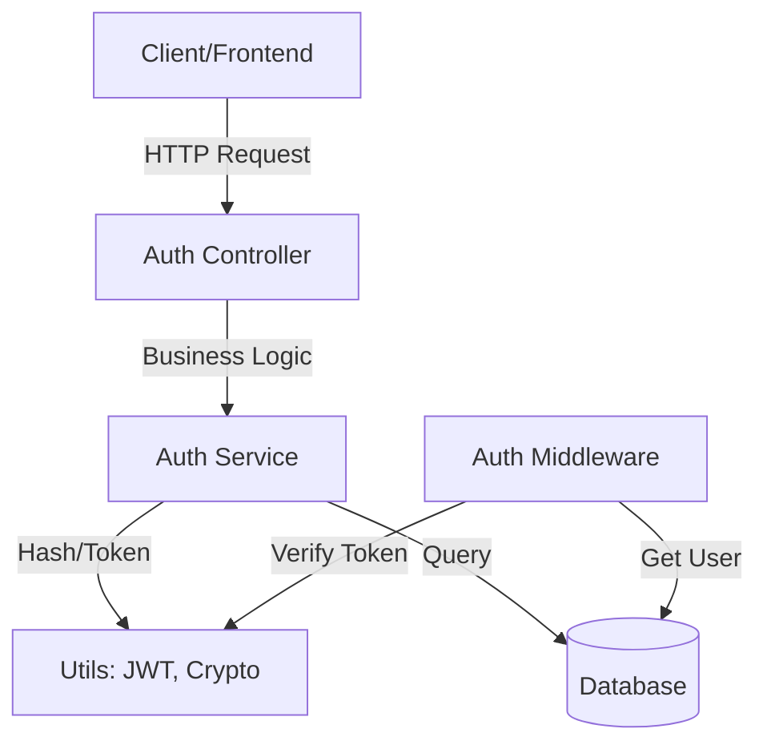
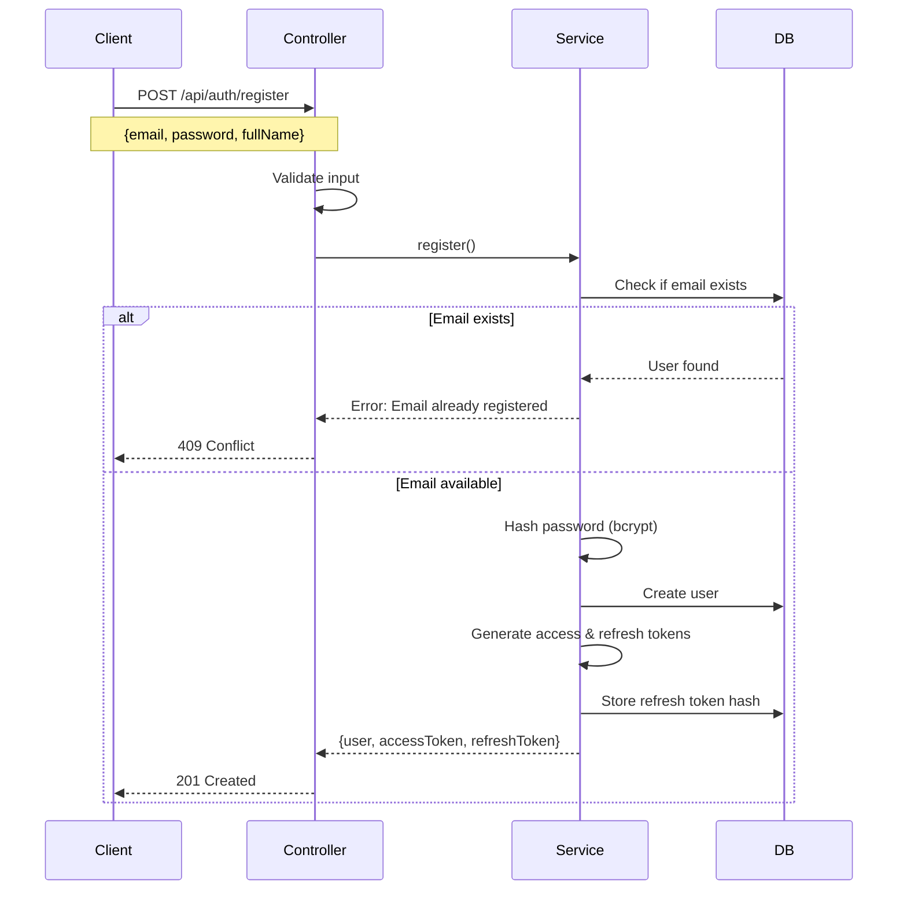
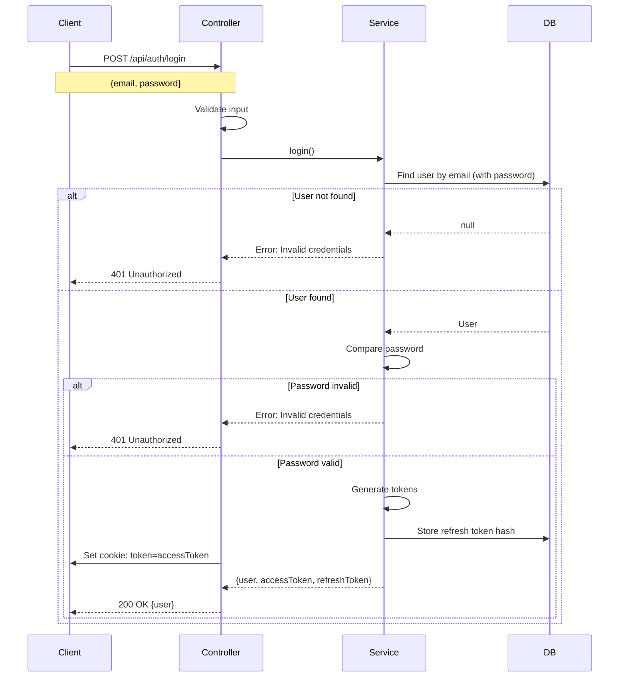
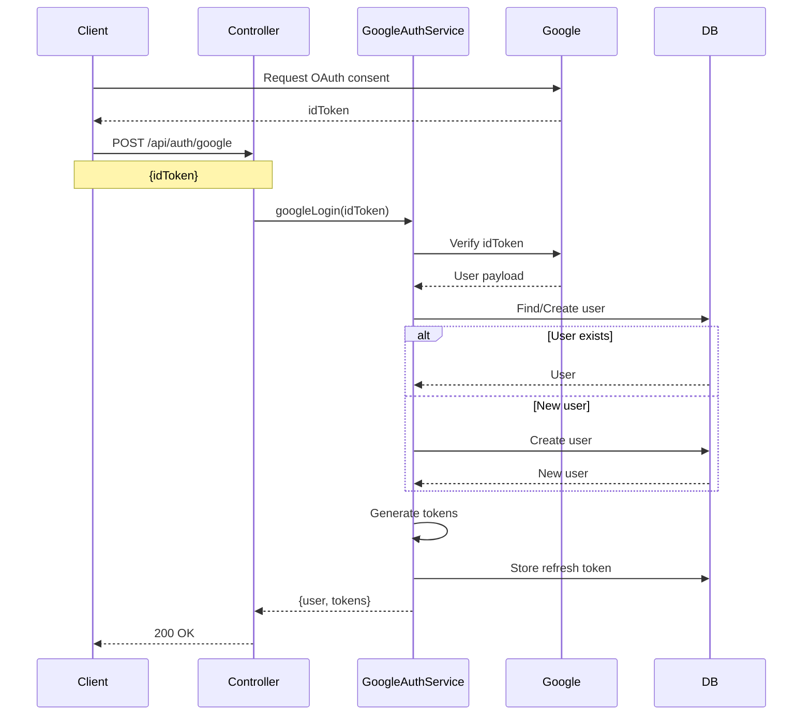
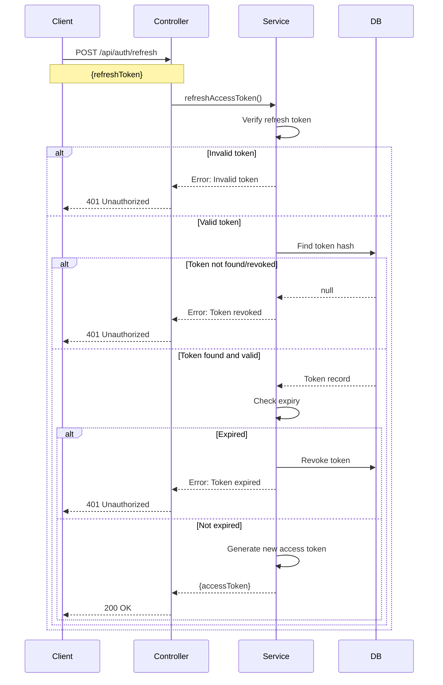
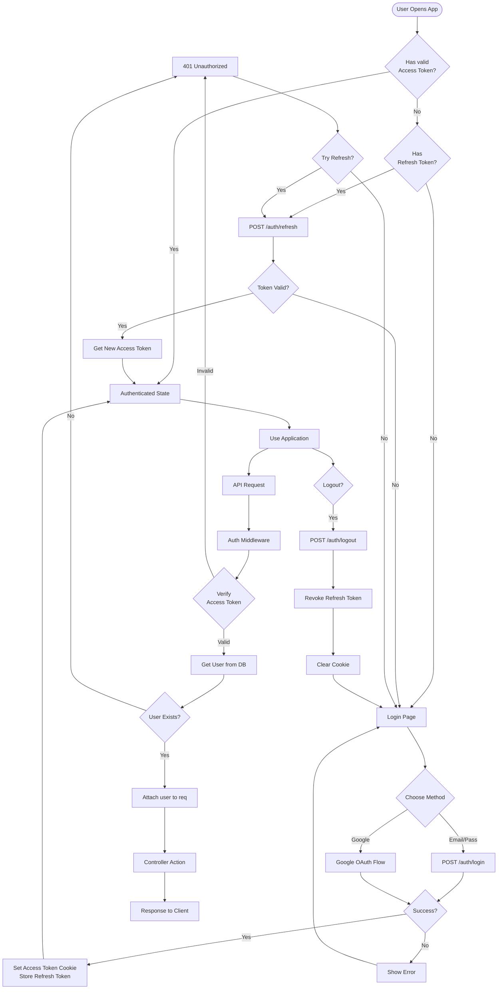
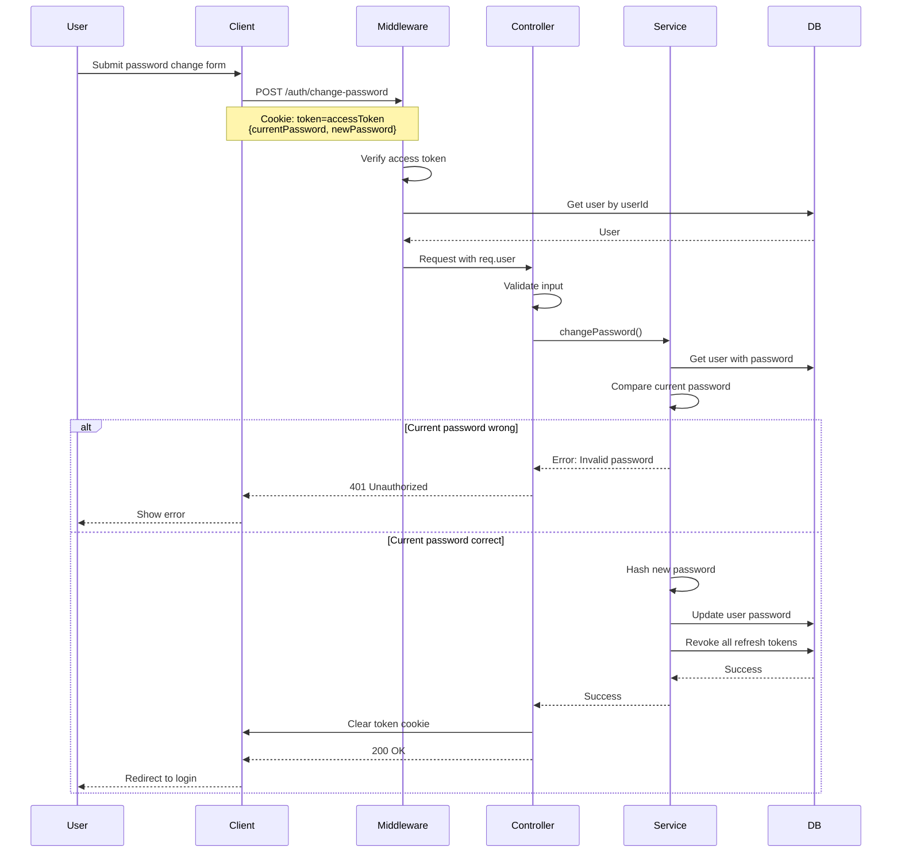

# Authentication Flow Documentation

## Table of Contents
1. [Overview](#overview)
2. [Architecture](#architecture)
3. [Authentication Methods](#authentication-methods)
4. [Token Management](#token-management)
5. [API Endpoints](#api-endpoints)
6. [Database Schema](#database-schema)
7. [Security Features](#security-features)
8. [Flow Diagrams](#flow-diagrams)
9. [Error Handling](#error-handling)

---

## Overview

HUStudent sử dụng hệ thống xác thực (authentication) dựa trên **JWT (JSON Web Tokens)** với hai loại token:
- **Access Token**: Token ngắn hạn (1 giờ) dùng để xác thực các request
- **Refresh Token**: Token dài hạn (7 ngày) dùng để refresh access token

Hệ thống hỗ trợ hai phương thức đăng nhập:
- Email/Password (Traditional)

---

## Architecture



### Components

#### 1. **Controllers** ([authController.js](file:///d:/STUDY/HUST/Subject/Web/hustudent/backend/controllers/authController.js))
Xử lý HTTP requests và responses:
- `register`: Đăng ký tài khoản mới
- `login`: Đăng nhập
- `refresh`: Làm mới access token
- `logout`: Đăng xuất
- `changePassword`: Đổi mật khẩu

#### 2. **Services** ([authService.js](file:///d:/STUDY/HUST/Subject/Web/hustudent/backend/services/authService.js))
Chứa business logic:
- Xác thực thông tin người dùng
- Tạo và quản lý tokens
- Hash mật khẩu
- Revoke tokens

#### 3. **Middleware** ([auth.js](file:///d:/STUDY/HUST/Subject/Web/hustudent/backend/middleware/auth.js))
Bảo vệ các protected routes:
- `authenticate`: Bắt buộc phải có token (Cookie hoặc Header `Authorization: Bearer <token>`)
- `optionalAuth`: Token không bắt buộc

#### 4. **Utilities**
- [jwt.js](file:///d:/STUDY/HUST/Subject/Web/hustudent/backend/utils/jwt.js): Sign và verify JWT tokens
- [crypto.js](file:///d:/STUDY/HUST/Subject/Web/hustudent/backend/utils/crypto.js): Hash passwords và tokens

---

## Authentication Methods

### 1. Email/Password Authentication

#### Registration Flow


**Code Flow:**
1. Client gửi `{email, password, fullName}` đến `/api/auth/register`
2. Controller validate input (required fields, password length ≥ 6)
3. Service kiểm tra email đã tồn tại chưa
4. Hash password bằng bcrypt (salt rounds = 10)
5. Tạo user mới trong database
6. Generate access token (expires: 1h) và refresh token (expires: 7d)
7. Lưu hash của refresh token vào database
8. Trả về user info và tokens

#### Login Flow


**Cookie Configuration:**
```javascript
res.cookie('token', accessToken, {
  httpOnly: true,              // Không thể truy cập từ JavaScript
  secure: NODE_ENV === 'production',  // HTTPS only in production
  sameSite: NODE_ENV === 'production' ? 'none' : 'lax', // Cross-site support in production
  maxAge: 3600000,             // 1 hour
  path: '/'
});
```

### 2. Google OAuth Authentication



---

## Token Management

### Access Token

**Payload:**
```json
{
  "userId": 123,
  "type": "access",
  "iat": 1703577600,
  "exp": 1703581200
}
```

**Lifespan:** 1 hour  
**Storage:** HTTP-only cookie (primary) hoặc `Authorization` header (fallback)
**Usage:** Gửi tự động qua cookie hoặc thủ công qua header `Authorization: Bearer <token>`

### Refresh Token

**Payload:**
```json
{
  "userId": 123,
  "type": "refresh",
  "iat": 1703577600,
  "exp": 1704182400
}
```

**Lifespan:** 7 days  
**Storage:** Client-side (localStorage/secure storage)  
**Database:** Hash của token được lưu trong bảng `auth_refresh_tokens`

### Token Refresh Flow



---

## API Endpoints

### Authentication Routes ([authRoutes.js](file:///d:/STUDY/HUST/Subject/Web/hustudent/backend/routes/authRoutes.js))

| Method | Endpoint | Auth | Rate Limit | Description |
|--------|----------|------|------------|-------------|
| POST | `/api/auth/register` | ❌ | 5/15min | Đăng ký tài khoản mới |
| POST | `/api/auth/login` | ❌ | 10/15min | Đăng nhập |
| POST | `/api/auth/google` | ❌ | 10/15min | Đăng nhập bằng Google |
| POST | `/api/auth/refresh` | ❌ | Default | Làm mới access token |
| POST | `/api/auth/logout` | ❌ | Default | Đăng xuất |
| POST | `/api/auth/change-password` | ✅ | 3/15min | Đổi mật khẩu |

### Request/Response Examples

#### 1. Register

**Request:**
```http
POST /api/auth/register
Content-Type: application/json

{
  "email": "student@hust.edu.vn",
  "password": "SecurePass123",
  "fullName": "Nguyễn Văn A"
}
```

**Response (201 Created):**
```json
{
  "data": {
    "user": {
      "id": 1,
      "email": "student@hust.edu.vn",
      "full_name": "Nguyễn Văn A",
      "auth_provider": "email",
      "created_at": "2024-12-26T07:00:00.000Z"
    },
    "accessToken": "eyJhbGciOiJIUzI1NiIs...",
    "refreshToken": "eyJhbGciOiJIUzI1NiIs..."
  }
}
```

#### 2. Login

**Request:**
```http
POST /api/auth/login
Content-Type: application/json

{
  "email": "student@hust.edu.vn",
  "password": "SecurePass123"
}
```

**Response (200 OK):**
```json
{
  "data": {
    "user": {
      "id": 1,
      "email": "student@hust.edu.vn",
      "full_name": "Nguyễn Văn A",
      "avatar_url": null
    }
  }
}
```

**Set-Cookie Header:**
```
token=eyJhbGciOiJIUzI1NiIs...; Path=/; HttpOnly; Secure; SameSite=Strict; Max-Age=3600
```

#### 3. Refresh Token

**Request:**
```http
POST /api/auth/refresh
Content-Type: application/json

{
  "refreshToken": "eyJhbGciOiJIUzI1NiIs..."
}
```

**Response (200 OK):**
```json
{
  "data": {
    "accessToken": "eyJhbGciOiJIUzI1NiIs..."
  }
}
```

#### 4. Change Password

**Request:**
```http
POST /api/auth/change-password
Cookie: token=eyJhbGciOiJIUzI1NiIs...
Content-Type: application/json

{
  "currentPassword": "SecurePass123",
  "newPassword": "NewSecurePass456"
}
```

**Response (200 OK):**
```json
{
  "data": {
    "message": "Password changed successfully"
  }
}
```

> **Note:** Sau khi đổi mật khẩu, tất cả refresh tokens hiện tại sẽ bị revoke

---

## Database Schema

### Users Table

```sql
CREATE TABLE users (
  id SERIAL PRIMARY KEY,
  email VARCHAR(255) UNIQUE NOT NULL,
  password_hash VARCHAR(255),
  full_name VARCHAR(255) NOT NULL,
  avatar_url TEXT,
  auth_provider VARCHAR(50) DEFAULT 'email',  -- 'email' | 'google'
  google_id VARCHAR(255) UNIQUE,
  bio TEXT,
  major VARCHAR(100),
  year INTEGER,
  deleted_at TIMESTAMP,
  created_at TIMESTAMP DEFAULT CURRENT_TIMESTAMP,
  updated_at TIMESTAMP DEFAULT CURRENT_TIMESTAMP
);
```

**Model:** [User.js](file:///d:/STUDY/HUST/Subject/Web/hustudent/backend/models/User.js)

**Scopes:**
- `defaultScope`: Ẩn `password_hash` (bảo mật)
- `withPassword`: Bao gồm `password_hash` (chỉ dùng khi login/change password)

### Auth Refresh Tokens Table

```sql
CREATE TABLE auth_refresh_tokens (
  id SERIAL PRIMARY KEY,
  user_id INTEGER NOT NULL,
  token_hash VARCHAR(255) NOT NULL,
  expires_at TIMESTAMP NOT NULL,
  revoked BOOLEAN DEFAULT FALSE,
  created_at TIMESTAMP DEFAULT CURRENT_TIMESTAMP,
  FOREIGN KEY (user_id) REFERENCES users(id) ON DELETE CASCADE
);
```

**Model:** [AuthRefreshToken.js](file:///d:/STUDY/HUST/Subject/Web/hustudent/backend/models/AuthRefreshToken.js)

**Indexes:**
- `token_hash` (để tìm kiếm nhanh)
- `user_id` (foreign key)

---

## Security Features

### 1. Password Security

**Hashing Algorithm:**
```javascript
import bcrypt from 'bcryptjs';

export const hashPassword = async (password) => {
  const salt = await bcrypt.genSalt(10);
  return bcrypt.hash(password, salt);
};

export const comparePassword = async (password, hash) => {
  return bcrypt.compare(password, hash);
};
```

- Sử dụng **bcrypt** với 10 salt rounds
- Password phải có độ dài tối thiểu 6 ký tự
- Không bao giờ lưu plaintext password

### 2. Token Security

**Token Hashing:**
```javascript
import crypto from 'crypto';

export const hashToken = (token) => {
  return crypto
    .createHash('sha256')
    .update(token)
    .digest('hex');
};
```

- Refresh tokens được hash (SHA-256) trước khi lưu vào database
- Chỉ hash được lưu, không lưu plaintext token
- Access tokens được gửi qua **HTTP-only cookies** (XSS protection)

### 3. Rate Limiting

Bảo vệ khỏi brute-force attacks:

```javascript
// Login: 10 requests per 15 minutes
loginLimiter: {
  windowMs: 15 * 60 * 1000,
  max: 10
}

// Register: 5 requests per 15 minutes
registerLimiter: {
  windowMs: 15 * 60 * 1000,
  max: 5
}

// Password change: 3 requests per 15 minutes
passwordChangeLimiter: {
  windowMs: 15 * 60 * 1000,
  max: 3
}
```

### 4. Input Validation

Middleware tự động validate input ([security.js](file:///d:/STUDY/HUST/Subject/Web/hustudent/backend/middleware/security.js)):

```javascript
validateEmail()       // Email format validation
validatePassword()    // Password strength + sanitization
validateName()        // Name sanitization
validateString()      // General string sanitization (XSS protection)
```

**Sanitization:**
- Loại bỏ HTML tags
- Escape special characters
- Trim whitespace

### 5. CORS Configuration

```javascript
app.use(cors({
  origin: process.env.FRONTEND_URL,
  credentials: true  // Allow cookies
}));
```

### 6. Cookie Security

- `httpOnly`: Không thể truy cập từ JavaScript
- `secure`: Chỉ gửi qua HTTPS (production)
- `sameSite: 'strict'`: CSRF protection
- `maxAge`: Auto-expire sau 1 giờ

---

## Flow Diagrams

### Complete Authentication Flow



### Password Change Flow



---

## Error Handling

### Standard Error Response

```json
{
  "error": {
    "code": "AUTH_INVALID_CREDENTIALS",
    "message": "Invalid email or password",
    "details": null
  }
}
```

### Error Codes

| Code | HTTP Status | Description |
|------|-------------|-------------|
| `AUTH_REQUIRED` | 401 | No authentication token provided |
| `AUTH_INVALID_TOKEN` | 401 | Token is invalid or expired |
| `AUTH_INVALID_CREDENTIALS` | 401 | Wrong email or password |
| `VALIDATION_ERROR` | 400 | Input validation failed |
| `CONFLICT` | 409 | Email already exists |
| `NOT_FOUND` | 404 | User not found |
| `RATE_LIMIT_EXCEEDED` | 429 | Too many requests |

### Error Handling Code

```javascript
// In authController.js
try {
  const result = await authService.login({ email, password });
  res.json({ data: result });
} catch (error) {
  next(error);  // Pass to error handler middleware
}

// Global error handler (app.js)
app.use((error, req, res, next) => {
  if (error instanceof AppError) {
    return res.status(error.statusCode).json({
      error: {
        code: error.code,
        message: error.message,
        details: error.details
      }
    });
  }
  // Handle unexpected errors
  res.status(500).json({
    error: {
      code: 'INTERNAL_ERROR',
      message: 'An unexpected error occurred'
    }
  });
});
```

---

## Best Practices

### Client-Side Implementation

1. **Store Tokens Securely:**
   ```javascript
   // Access token: Stored in HTTP-only cookie (automatic)
   // Refresh token: Store in localStorage or secure storage
   localStorage.setItem('refreshToken', refreshToken);
   ```

2. **Auto-Refresh Logic:**
   ```javascript
   // Axios interceptor
   axios.interceptors.response.use(
     response => response,
     async error => {
       if (error.response?.status === 401) {
         const refreshToken = localStorage.getItem('refreshToken');
         if (refreshToken) {
           const { data } = await axios.post('/auth/refresh', { refreshToken });
           // Retry original request (cookie auto-updated)
           return axios(error.config);
         }
       }
       return Promise.reject(error);
     }
   );
   ```

3. **Logout Cleanup:**
   ```javascript
   const logout = async () => {
     const refreshToken = localStorage.getItem('refreshToken');
     await axios.post('/auth/logout', { refreshToken });
     localStorage.removeItem('refreshToken');
     // Cookie cleared by server
     redirect('/login');
   };
   ```

### Server-Side Best Practices

1. **Use Scopes for Password:**
   ```javascript
   // Normal queries - password excluded
   User.findOne({ where: { email } });
   
   // Login/password change - include password
   User.scope('withPassword').findOne({ where: { email } });
   ```

2. **Revoke Tokens on Security Events:**
   ```javascript
   // Password change
   await revokeAllTokens(userId);
   
   // Suspicious activity
   await revokeAllTokens(userId);
   ```

3. **Regular Token Cleanup:**
   ```javascript
   // Cron job to delete expired/revoked tokens
   await AuthRefreshToken.destroy({
     where: {
       [Op.or]: [
         { revoked: true },
         { expires_at: { [Op.lt]: new Date() } }
       ]
     }
   });
   ```

---

## Testing

### Manual Testing with cURL

**Register:**
```bash
curl -X POST http://localhost:5000/api/auth/register \
  -H "Content-Type: application/json" \
  -d '{"email":"test@hust.edu.vn","password":"test123","fullName":"Test User"}'
```

**Login:**
```bash
curl -X POST http://localhost:5000/api/auth/login \
  -H "Content-Type: application/json" \
  -d '{"email":"test@hust.edu.vn","password":"test123"}' \
  -c cookies.txt
```

**Protected Route:**
```bash
curl http://localhost:5000/api/users/profile \
  -b cookies.txt
```

**Refresh:**
```bash
curl -X POST http://localhost:5000/api/auth/refresh \
  -H "Content-Type: application/json" \
  -d '{"refreshToken":"YOUR_REFRESH_TOKEN"}'
```

---

## Related Files

### Backend Structure
```
backend/
├── controllers/
│   └── authController.js       # HTTP handlers
├── services/
│   ├── authService.js          # Business logic
│   └── googleAuthService.js    # Google OAuth
├── middleware/
│   ├── auth.js                 # Authentication middleware
│   ├── rateLimits.js          # Rate limiting
│   └── security.js            # Input validation
├── models/
│   ├── User.js                # User model
│   └── AuthRefreshToken.js    # Refresh token model
├── routes/
│   └── authRoutes.js          # Route definitions
└── utils/
    ├── jwt.js                 # JWT utilities
    ├── crypto.js              # Hashing utilities
    └── errors.js              # Error classes
```

---

## References

- [JWT Best Practices](https://tools.ietf.org/html/rfc8725)
- [OWASP Authentication Cheat Sheet](https://cheatsheetseries.owasp.org/cheatsheets/Authentication_Cheat_Sheet.html)
- [Express Security Best Practices](https://expressjs.com/en/advanced/best-practice-security.html)
- Project Security Documentation: [SECURITY.md](file:///d:/STUDY/HUST/Subject/Web/hustudent/docs/SECURITY.md)
