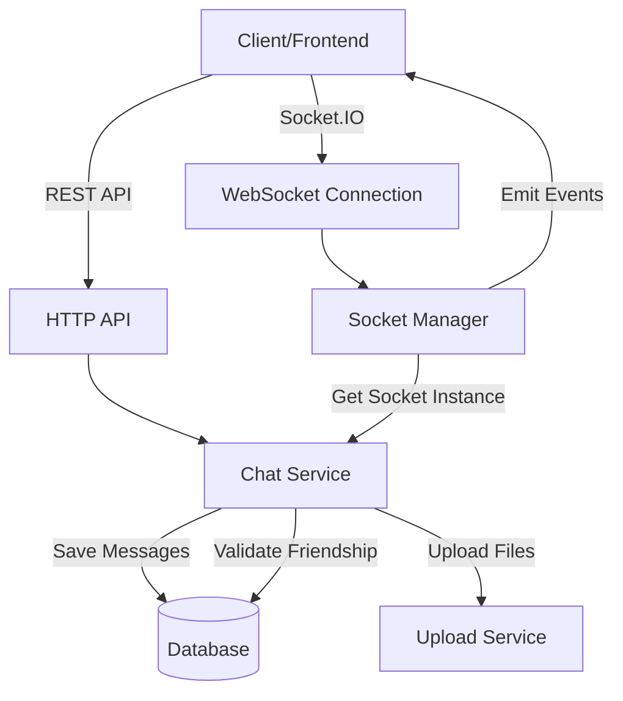
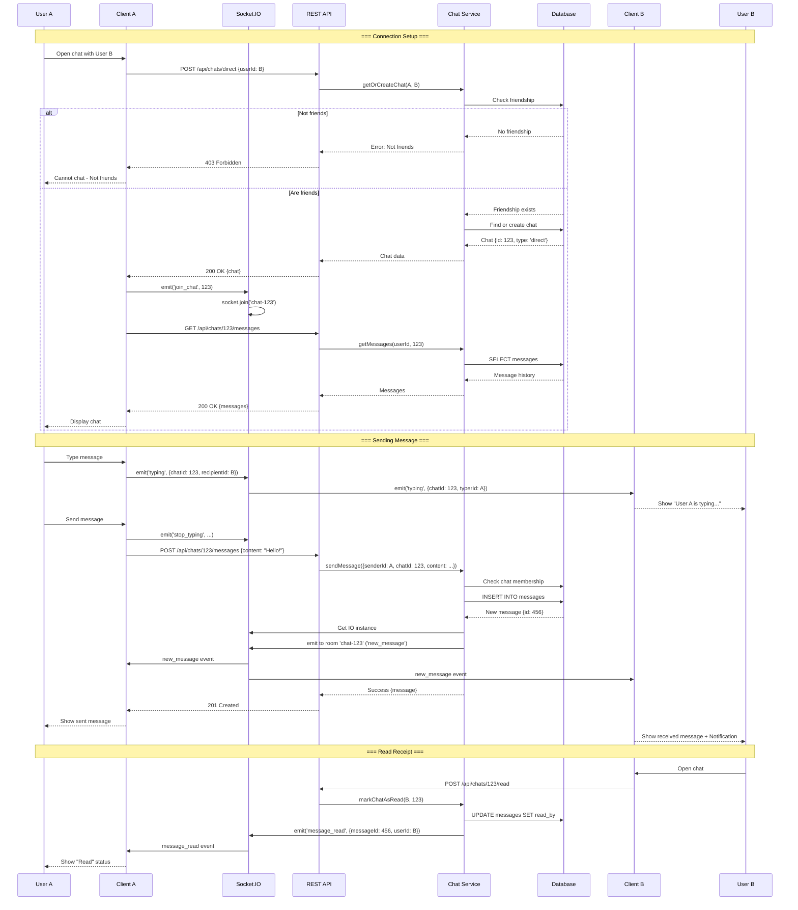
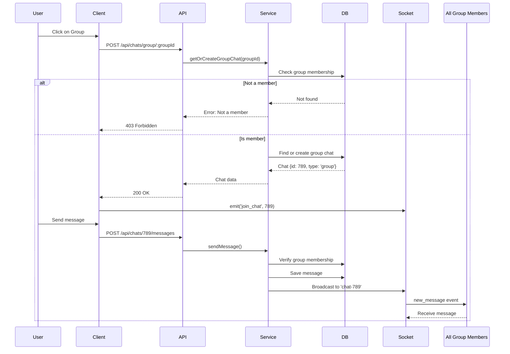
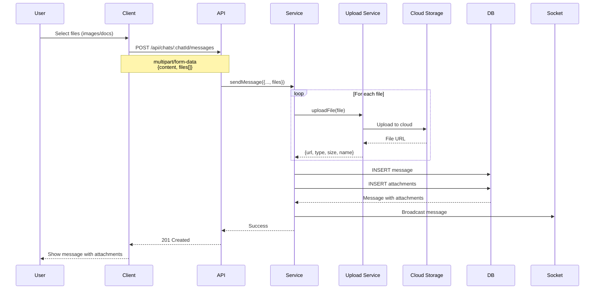

# Chat System - Real-time Messaging

## Table of Contents
1. [Overview](#overview)
2. [Architecture](#architecture)
3. [Database Schema](#database-schema)
4. [API Endpoints](#api-endpoints)
5. [WebSocket Events](#websocket-events)
6. [Flow Diagrams](#flow-diagrams)
7. [Implementation Details](#implementation-details)

---

## Overview

Hệ thống **Chat** hỗ trợ nhắn tin real-time giữa các users và trong groups, sử dụng **Socket.IO** cho WebSocket connections và HTTP REST API cho message history.
Xác thực hỗ trợ cả **Cookie** (token/accessToken) và **Authorization Header** (Bearer Token). WebSocket connection ưu tiên kiểm tra Header trước, sau đó đến Cookie, và cuối cùng là Handshake Auth.

### Key Features

- ✅ **1-on-1 Chat**: Nhắn tin trực tiếp giữa hai users
- ✅ **Group Chat**: Nhắn tin trong nhóm học
- ✅ **Real-time Messages**: Gửi/nhận tin nhắn ngay lập tức qua WebSocket
- ✅ **Message Attachments**: Hỗ trợ đính kèm file/ảnh
- ✅ **Read Receipts**: Đánh dấu đã đọc tin nhắn
- ✅ **Typing Indicators**: Hiển thị khi người khác đang gõ
- ✅ **Message History**: Pagination và infinite scroll
- ✅ **Friendship Validation**: Chỉ cho phép chat khi đã là bạn bè

---

## Architecture



### Components

#### 1. **HTTP REST API**
- Create/Get chats
- Send messages (with files)
- Get message history
- Mark as read

#### 2. **WebSocket (Socket.IO)**
- Real-time message delivery
- Typing indicators
- Online/offline status
- Room management

#### 3. **Chat Service** ([chatService.js](file:///d:/STUDY/HUST/Subject/Web/hustudent/backend/services/chatService.js))
- Business logic
- Friendship validation
- Message persistence
- Socket event emission

#### 4. **Socket Manager** ([socketManager.js](file:///d:/STUDY/HUST/Subject/Web/hustudent/backend/socket/socketManager.js))
- Socket.IO initialization
- Authentication middleware
- Event handlers
- Room management

---

## Database Schema

### Chats Table

```sql
CREATE TABLE chats (
  id SERIAL PRIMARY KEY,
  type VARCHAR(20) NOT NULL DEFAULT 'direct',  -- 'direct' | 'group'
  group_id INTEGER,
  user_a INTEGER,
  user_b INTEGER,
  created_at TIMESTAMP DEFAULT NOW(),
  updated_at TIMESTAMP DEFAULT NOW(),
  FOREIGN KEY (group_id) REFERENCES groups(id) ON DELETE CASCADE,
  FOREIGN KEY (user_a) REFERENCES users(id) ON DELETE CASCADE,
  FOREIGN KEY (user_b) REFERENCES users(id) ON DELETE CASCADE,
  CHECK (
    (type = 'direct' AND user_a IS NOT NULL AND user_b IS NOT NULL AND group_id IS NULL) OR
    (type = 'group' AND group_id IS NOT NULL AND user_a IS NULL AND user_b IS NULL)
  )
);
```

**Model:** [Chat.js](file:///d:/STUDY/HUST/Subject/Web/hustudent/backend/models/Chat.js)

**Validation:**
- Direct chat: Phải có `user_a` và `user_b`, không có `group_id`
- Group chat: Phải có `group_id`, không có `user_a`, `user_b`
- Không cho phép chat với chính mình

**Helper Method:**
```javascript
Chat.getOrderedUsers(userId1, userId2)
// Returns: { userA: min(id1, id2), userB: max(id1, id2) }
// Đảm bảo consistency khi tìm/tạo chat
```

### Messages Table

```sql
CREATE TABLE messages (
  id SERIAL PRIMARY KEY,
  chat_id INTEGER NOT NULL,
  sender_id INTEGER NOT NULL,
  content TEXT,
  read_by JSONB DEFAULT '[]',
  deleted_at TIMESTAMP,
  created_at TIMESTAMP DEFAULT NOW(),
  updated_at TIMESTAMP DEFAULT NOW(),
  FOREIGN KEY (chat_id) REFERENCES chats(id) ON DELETE CASCADE,
  FOREIGN KEY (sender_id) REFERENCES users(id) ON DELETE CASCADE
);

CREATE INDEX idx_messages_chat_id ON messages(chat_id);
CREATE INDEX idx_messages_created_at ON messages(created_at DESC);
```

**Model:** [Message.js](file:///d:/STUDY/HUST/Subject/Web/hustudent/backend/models/Message.js)

**Fields:**
- `read_by`: Array of user IDs who have read the message
- `deleted_at`: Soft delete (null = not deleted)

### Message Attachments Table

```sql
CREATE TABLE message_attachments (
  id SERIAL PRIMARY KEY,
  message_id INTEGER NOT NULL,
  file_url TEXT NOT NULL,
  file_type VARCHAR(50),
  file_size INTEGER,
  file_name VARCHAR(255),
  created_at TIMESTAMP DEFAULT NOW(),
  FOREIGN KEY (message_id) REFERENCES messages(id) ON DELETE CASCADE
);
```

**Model:** [MessageAttachment.js](file:///d:/STUDY/HUST/Subject/Web/hustudent/backend/models/MessageAttachment.js)

---

## API Endpoints

### Chat Management Routes

| Method | Endpoint | Auth | Description |
|--------|----------|------|-------------|
| GET | `/api/chats` | ✅ | Lấy danh sách tất cả chats |
| GET | `/api/chats/:chatId` | ✅ | Lấy thông tin chi tiết chat |
| POST | `/api/chats/direct` | ✅ | Tạo/lấy direct chat với user |
| POST | `/api/chats/group/:groupId` | ✅ | Tạo/lấy group chat |

### Message Routes

| Method | Endpoint | Auth | Description |
|--------|----------|------|-------------|
| GET | `/api/chats/:chatId/messages` | ✅ | Lấy message history |
| POST | `/api/chats/:chatId/messages` | ✅ | Gửi tin nhắn mới |
| POST | `/api/chats/:chatId/read` | ✅ | Đánh dấu toàn bộ chat đã đọc |
| POST | `/api/messages/:messageId/read` | ✅ | Đánh dấu tin nhắn đã đọc |

---

## WebSocket Events

### Socket.IO Connection

**Connection URL:**
```
ws://localhost:5000/socket.io
```

**Authentication Methods:**
1. **Authorization Header (Best for Mobile/API):**
```javascript
// Authorization: Bearer <token>
io.connect('http://localhost:5000', {
  extraHeaders: {
    Authorization: `Bearer ${token}`
  }
});
```

2. **Cookie (Best for Web):**
```javascript
// Browser automatically sends 'token' or 'accessToken' cookie
io.connect('http://localhost:5000', {
  withCredentials: true
});
```

3. **Handshake Auth (Alternative):**
```javascript
io.connect('http://localhost:5000', {
  auth: { token: '...' }
});
```

**Server Authentication Logic:**
```javascript
io.use((socket, next) => {
  let token = null;
  
  // 1. Check Authorization Header
  const authHeader = socket.handshake.headers.authorization;
  if (authHeader?.startsWith('Bearer ')) token = authHeader.split(' ')[1];
  
  // 2. Check Cookes
  if (!token) {
    const cookies = parseCookies(socket.handshake.headers.cookie);
    token = cookies.token || cookies.accessToken;
  }
  
  // 3. Check Auth Object
  if (!token) token = socket.handshake.auth?.token;
  
  // ... Verify token ...
});
```

### Client → Server Events

| Event | Payload | Description |
|-------|---------|-------------|
| `join_chat` | `chatId` | Join chat room để nhận messages |
| `leave_chat` | `chatId` | Leave chat room |
| `typing` | `{chatId, recipientId?}` | Báo đang gõ tin nhắn |
| `stop_typing` | `{chatId, recipientId?}` | Báo đã dừng gõ |

### Server → Client Events

| Event | Payload | Description |
|-------|---------|-------------|
| `new_message` | `{message, chat}` | Tin nhắn mới |
| `message_read` | `{messageId, userId}` | Tin nhắn đã được đọc |
| `typing` | `{chatId, typerId}` | User đang gõ |
| `stop_typing` | `{chatId, typerId}` | User dừng gõ |

---

## Flow Diagrams

### Complete Chat Flow



### Group Chat Flow



### File Upload Flow



---

## Implementation Details

### 1. Socket.IO Initialization

**File:** [socketManager.js](file:///d:/STUDY/HUST/Subject/Web/hustudent/backend/socket/socketManager.js)

```javascript
export const init = (server) => {
  io = new Server(server, {
    cors: {
      origin: [env.FRONTEND_URL, 'http://localhost:5173'],
      credentials: true,
      methods: ["GET", "POST", "PUT", "PATCH", "DELETE"]
    },
    path: '/socket.io',
    transports: ['websocket', 'polling']
  });

  // Authentication Middleware
  io.use((socket, next) => {
    try {
      let token = null;

      // 1. Check Authorization Header (Bearer Token)
      const authHeader = socket.handshake.headers.authorization;
      if (authHeader && authHeader.startsWith('Bearer ')) {
        token = authHeader.split(' ')[1];
      }

      // 2. Check Cookies if no header token found
      if (!token && socket.handshake.headers.cookie) {
        const cookies = parseCookies(socket.handshake.headers.cookie);
        token = cookies.token || cookies.accessToken;
      }

      // 3. Check Handshake Auth Object
      if (!token && socket.handshake.auth && socket.handshake.auth.token) {
        token = socket.handshake.auth.token;
      }
      
      if (!token) {
        return next(new Error('Authentication error: No token found'));
      }

      const decoded = verifyToken(token);
      if (!decoded || !decoded.userId) {
        return next(new Error('Authentication error: Invalid token'));
      }

      socket.userId = decoded.userId;
      next();
    } catch (err) {
      next(new Error('Authentication error'));
    }
  });

  io.on('connection', (socket) => {
    console.log(`🔌 Socket connected: ${socket.id} (User: ${socket.userId})`);

    // Join user's personal room for direct messaging
    socket.join(socket.userId);

    socket.on('disconnect', () => {
      console.log(`Socket disconnected: ${socket.id}`);
    });

    // Chat room management
    socket.on('join_chat', (chatId) => {
      const room = `chat-${chatId}`;
      socket.join(room);
      console.log(`User ${socket.userId} joined room ${room}`);
    });

    socket.on('leave_chat', (chatId) => {
      const room = `chat-${chatId}`;
      socket.leave(room);
    });

    // Typing indicators
    socket.on('typing', ({ chatId, recipientId }) => {
      if (recipientId) {
        // Direct chat: send to specific user
        io.to(recipientId).emit('typing', { chatId, typerId: socket.userId });
      } else {
        // Group chat: broadcast to room
        socket.to(`chat-${chatId}`).emit('typing', { chatId, typerId: socket.userId });
      }
    });

    socket.on('stop_typing', ({ chatId, recipientId }) => {
      if (recipientId) {
        io.to(recipientId).emit('stop_typing', { chatId, typerId: socket.userId });
      } else {
        socket.to(`chat-${chatId}`).emit('stop_typing', { chatId, typerId: socket.userId });
      }
    });
  });

  return io;
};
```

### 2. Get or Create Chat

**File:** [chatService.js:171-188](file:///d:/STUDY/HUST/Subject/Web/hustudent/backend/services/chatService.js#L171-L188)

```javascript
async getOrCreateChat(userId1, userId2) {
  // Validate friendship
  const canChat = await this.canChat(userId1, userId2);
  if (!canChat) {
    throw new AppError(ErrorCodes.FORBIDDEN, 'Cannot chat with this user');
  }

  // Get ordered IDs for consistency
  const { userA, userB } = Chat.getOrderedUsers(userId1, userId2);

  // Find existing chat
  let chat = await Chat.findOne({
    where: { type: 'direct', user_a: userA, user_b: userB }
  });

  // Create if not exists
  if (!chat) {
    chat = await Chat.create({
      type: 'direct',
      user_a: userA,
      user_b: userB
    });
  }

  return chat;
}
```

### 3. Send Message

**File:** [chatService.js:28-93](file:///d:/STUDY/HUST/Subject/Web/hustudent/backend/services/chatService.js#L28-L93)

```javascript
async sendMessage({ senderId, chatId, content, files = [] }) {
  // Get chat
  const chat = await Chat.findByPk(chatId, {
    include: [
      { model: User, as: 'userA', attributes: ['id', 'full_name'] },
      { model: User, as: 'userB', attributes: ['id', 'full_name'] }
    ]
  });

  if (!chat) {
    throw new AppError(ErrorCodes.NOT_FOUND, 'Chat not found');
  }

  // Verify sender is part of chat
  if (chat.type === 'direct') {
    if (chat.user_a !== senderId && chat.user_b !== senderId) {
      throw new AppError(ErrorCodes.FORBIDDEN, 'Not a member of this chat');
    }
  } else if (chat.type === 'group') {
    const member = await GroupMember.findOne({
      where: { group_id: chat.group_id, user_id: senderId, status: 'active' }
    });
    if (!member) {
      throw new AppError(ErrorCodes.FORBIDDEN, 'Not a member of this group');
    }
  }

  // Create message
  const message = await Message.create({
    chat_id: chatId,
    sender_id: senderId,
    content,
    read_by: [senderId]  // Sender has "read" their own message
  });

  // Upload attachments
  if (files && files.length > 0) {
    const attachments = await Promise.all(
      files.map(async (file) => {
        const uploaded = await uploadService.uploadFile(file);
        return MessageAttachment.create({
          message_id: message.id,
          file_url: uploaded.url,
          file_type: uploaded.mimeType,
          file_size: uploaded.size,
          file_name: uploaded.originalName
        });
      })
    );
    message.attachments = attachments;
  }

  // Load sender info
  const sender = await User.findByPk(senderId, {
    attributes: ['id', 'full_name', 'avatar_url']
  });

  // Emit socket event
  const recipientId = chat.type === 'direct'
    ? (chat.user_a === senderId ? chat.user_b : chat.user_a)
    : null;

  this.emitMessage(chat, { ...message.toJSON(), sender }, recipientId);

  return message;
}
```

### 4. Emit Message via Socket

**File:** [chatService.js:95-113](file:///d:/STUDY/HUST/Subject/Web/hustudent/backend/services/chatService.js#L95-L113)

```javascript
emitMessage(chat, message, recipientId) {
  try {
    const io = socketManager.getIO();

    if (chat.type === 'direct' && recipientId) {
      // Direct chat: emit to specific user room
      io.to(recipientId).emit('new_message', {
        chatId: chat.id,
        message,
        chat
      });
    } else if (chat.type === 'group') {
      // Group chat: emit to chat room
      io.to(`chat-${chat.id}`).emit('new_message', {
        chatId: chat.id,
        message,
        chat
      });
    }
  } catch (err) {
    console.error('Error emitting message:', err);
  }
}
```

### 5. Get Message History

**File:** [chatService.js:301-335](file:///d:/STUDY/HUST/Subject/Web/hustudent/backend/services/chatService.js#L301-L335)

```javascript
async getMessages(userId, chatId, { before, limit = 50 }) {
  // Verify user is part of chat
  const chat = await Chat.findByPk(chatId);
  if (!chat) {
    throw new AppError(ErrorCodes.NOT_FOUND, 'Chat not found');
  }

  let isMember = false;
  if (chat.type === 'direct') {
    isMember = (chat.user_a === userId || chat.user_b === userId);
  } else {
    const member = await GroupMember.findOne({
      where: { group_id: chat.group_id, user_id: userId }
    });
    isMember = !!member;
  }

  if (!isMember) {
    throw new AppError(ErrorCodes.FORBIDDEN, 'Not a member of this chat');
  }

  // Build query
  const where = { chat_id: chatId, deleted_at: null };
  if (before) {
    where.id = { [Op.lt]: before };
  }

  // Get messages
  const messages = await Message.findAll({
    where,
    include: [
      { model: User, as: 'sender', attributes: ['id', 'full_name', 'avatar_url'] },
      { model: MessageAttachment, as: 'attachments' }
    ],
    order: [['created_at', 'DESC']],
    limit
  });

  return messages.reverse(); // Oldest first
}
```

### 6. Mark as Read

**File:** [chatService.js:141-169](file:///d:/STUDY/HUST/Subject/Web/hustudent/backend/services/chatService.js#L141-L169)

```javascript
async markChatAsRead(userId, chatId) {
  const chat = await Chat.findByPk(chatId);
  if (!chat) {
    throw new AppError(ErrorCodes.NOT_FOUND, 'Chat not found');
  }

  // Get unread messages
  const messages = await Message.findAll({
    where: {
      chat_id: chatId,
      sender_id: { [Op.ne]: userId },  // Not sent by me
      deleted_at: null,
      [Op.not]: {
        read_by: { [Op.contains]: [userId] }  // I haven't read yet
      }
    }
  });

  // Update each message
  await Promise.all(
    messages.map(async (msg) => {
      const readBy = msg.read_by || [];
      if (!readBy.includes(userId)) {
        readBy.push(userId);
        await msg.update({ read_by: readBy });
        
        // Emit socket event
        const io = socketManager.getIO();
        io.to(msg.sender_id).emit('message_read', {
          messageId: msg.id,
          userId
        });
      }
    })
  );

  return { count: messages.length };
}
```

---

## Request/Response Examples

### 1. Create/Get Direct Chat

**Request:**
```http
POST /api/chats/direct
Cookie: token=...
# OR
Authorization: Bearer <token>
Content-Type: application/json

{
  "userId": 42
}
```

**Response (200 OK):**
```json
{
  "data": {
    "id": 123,
    "type": "direct",
    "user_a": 1,
    "user_b": 42,
    "created_at": "2024-12-26T07:00:00.000Z",
    "userA": {
      "id": 1,
      "full_name": "Nguyễn Văn A"
    },
    "userB": {
      "id": 42,
      "full_name": "Trần Văn B"
    }
  }
}
```

### 2. Send Message

**Request:**
```http
POST /api/chats/123/messages
Cookie: token=...
Content-Type: application/json

{
  "content": "Hello! How are you?"
}
```

**Response (201 Created):**
```json
{
  "data": {
    "id": 456,
    "chat_id": 123,
    "sender_id": 1,
    "content": "Hello! How are you?",
    "read_by": [1],
    "created_at": "2024-12-26T07:30:00.000Z",
    "sender": {
      "id": 1,
      "full_name": "Nguyễn Văn A",
      "avatar_url": "https://..."
    }
  }
}
```

**Socket Event Emitted:**
```javascript
// To recipient (User 42)
{
  event: 'new_message',
  data: {
    chatId: 123,
    message: {
      id: 456,
      content: "Hello! How are you?",
      sender: { ... },
      created_at: "..."
    },
    chat: { ... }
  }
}
```

### 3. Get Message History

**Request:**
```http
GET /api/chats/123/messages?limit=50&before=450
Cookie: token=...
```

**Response (200 OK):**
```json
{
  "data": [
    {
      "id": 445,
      "chat_id": 123,
      "sender_id": 42,
      "content": "Hi there!",
      "read_by": [1, 42],
      "created_at": "2024-12-26T07:00:00.000Z",
      "sender": {
        "id": 42,
        "full_name": "Trần Văn B"
      },
      "attachments": []
    },
    {
      "id": 449,
      "sender_id": 1,
      "content": "Check this out",
      "attachments": [
        {
          "id": 12,
          "file_url": "https://cdn.../image.jpg",
          "file_type": "image/jpeg",
          "file_size": 245678,
          "file_name": "screenshot.jpg"
        }
      ]
    }
  ]
}
```

### 4. Get Chat List

**Request:**
```http
GET /api/chats
Cookie: token=...
```

**Response (200 OK):**
```json
{
  "data": [
    {
      "id": 123,
      "type": "direct",
      "otherUser": {
        "id": 42,
        "full_name": "Trần Văn B",
        "avatar_url": "https://..."
      },
      "lastMessage": {
        "id": 456,
        "content": "Hello! How are you?",
        "sender_id": 1,
        "created_at": "2024-12-26T07:30:00.000Z"
      },
      "unreadCount": 0
    },
    {
      "id": 789,
      "type": "group",
      "group": {
        "id": 15,
        "name": "IT3103 Study Group",
        "avatar_url": "https://..."
      },
      "lastMessage": {
        "content": "See you at 7pm!",
        "created_at": "2024-12-26T06:45:00.000Z"
      },
      "unreadCount": 3
    }
  ]
}
```

---

## Client Implementation Guide

### 1. Socket Connection

```javascript
import { io } from 'socket.io-client';

const socket = io('http://localhost:5000', {
  path: '/socket.io',
  withCredentials: true,  // Send HTTP-only cookie
  transports: ['websocket', 'polling']
});

socket.on('connect', () => {
  console.log('Connected:', socket.id);
});

socket.on('connect_error', (error) => {
  console.error('Connection failed:', error.message);
});
```

### 2. Join Chat Room

```javascript
const openChat = async (chatId) => {
  // Join socket room
  socket.emit('join_chat', chatId);
  
  // Fetch message history
  const response = await fetch(`/api/chats/${chatId}/messages?limit=50`, {
    credentials: 'include'
  });
  const { data: messages } = await response.json();
  
  setMessages(messages);
};
```

### 3. Send Message

```javascript
const sendMessage = async (chatId, content, files = []) => {
  const formData = new FormData();
  formData.append('content', content);
  files.forEach(file => formData.append('files', file));
  
  const response = await fetch(`/api/chats/${chatId}/messages`, {
    method: 'POST',
    credentials: 'include',
    body: formData
  });
  
  const { data: message } = await response.json();
  // Message will also arrive via socket event
};
```

### 4. Listen for New Messages

```javascript
useEffect(() => {
  socket.on('new_message', ({ chatId, message }) => {
    if (chatId === currentChatId) {
      setMessages(prev => [...prev, message]);
      
      // Mark as read if chat is open
      fetch(`/api/chats/${chatId}/read`, {
        method: 'POST',
        credentials: 'include'
      });
    } else {
      // Show notification
      showNotification(message);
    }
  });
  
  return () => socket.off('new_message');
}, [currentChatId]);
```

### 5. Typing Indicator

```javascript
const handleTyping = (chatId, recipientId) => {
  socket.emit('typing', { chatId, recipientId });
  
  clearTimeout(typingTimeout);
  typingTimeout = setTimeout(() => {
    socket.emit('stop_typing', { chatId, recipientId });
  }, 1000);
};

// Listen for typing
socket.on('typing', ({ chatId, typerId }) => {
  setTypingUsers(prev => ({ ...prev, [chatId]: typerId }));
});

socket.on('stop_typing', ({ chatId }) => {
  setTypingUsers(prev => {
    const updated = { ...prev };
    delete updated[chatId];
    return updated;
  });
});
```

---

## Best Practices

### 1. Performance
- ✅ Paginate message history (limit=50)
- ✅ Use cursor-based pagination (`before` parameter)
- ✅ Lazy load attachments
- ✅ Debounce typing indicators (1 second)

### 2. Security
- ✅ Validate friendship before allowing chat
- ✅ Verify group membership for group chats
- ✅ Sanitize message content (XSS protection)
- ✅ Authenticate socket connections

### 3. User Experience
- ✅ Show "typing..." indicators
- ✅ Display read receipts
- ✅ Auto-scroll to bottom on new message
- ✅ Unread count badges
- ✅ Desktop notifications for new messages

### 4. Error Handling
- ✅ Graceful socket reconnection
- ✅ Queue messages when offline
- ✅ Retry failed uploads
- ✅ Show connection status

---

## Related Files

### Backend Structure
```
backend/
├── socket/
│   └── socketManager.js           # Socket.IO setup
├── services/
│   ├── chatService.js             # Chat business logic
│   └── uploadService.js           # File upload handling
├── controllers/
│   └── chatController.js          # HTTP handlers
├── models/
│   ├── Chat.js                    # Chat model
│   ├── Message.js                 # Message model
│   └── MessageAttachment.js       # Attachment model
└── routes/
    └── chatRoutes.js              # Route definitions
```

---

## References

- [Socket.IO Documentation](https://socket.io/docs/v4/)
- [Authentication Flow](file:///d:/STUDY/HUST/Subject/Web/hustudent/docs/AUTHENTICATION_FLOW.md)
- [Security Guide](file:///d:/STUDY/HUST/Subject/Web/hustudent/docs/SECURITY.md)
