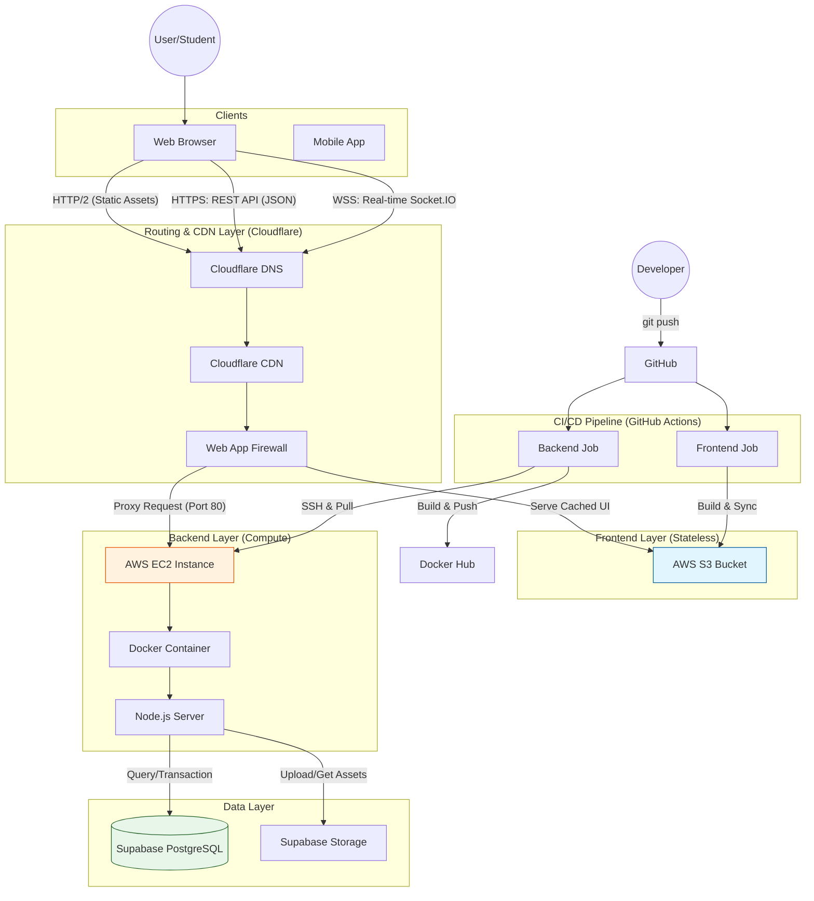

# 🎓 Báo cáo Kiến trúc & Triển khai Hệ thống

Tài liệu này được biên soạn để phục vụ cho việc thuyết trình đồ án, tập trung vào tính Khoa học, Hiệu năng và Bảo mật của hệ thống.

## 1. Sơ đồ Kiến trúc (Architecture Diagram)

Dưới đây là sơ đồ luồng dữ liệu thực tế của hệ thống:

---

## 2. Lý giải Công nghệ & Kiến trúc

### 2.1. Client-Server Decoupled (Tách biệt Frontend - Backend)
Thay vì gộp chung (Monolith) như các web cổ điển, hệ thống tách rời hoàn toàn:
*   **Frontend**: Là một ứng dụng ReactJS độc lập (Single Page Application). Được biên dịch thành file tĩnh (HTML/CSS/JS) và đặt trên **AWS S3**.
    *   *Ưu điểm*: Tải trang cực nhanh nhờ CDN, chi phí lưu trữ cực rẻ ($0.023/GB), không tốn tài nguyên server để render giao diện.
*   **Backend**: Node.js chạy trong **Docker Container** trên **AWS EC2**.
    *   *Ưu điểm*: Chỉ tập trung xử lý logic nhiệm vụ (API), dễ dàng mở rộng (Scale) độc lập với Frontend.

### 2.2. Reverse Proxy & CDN (Cloudflare)
Cloudflare đóng vai trò là lớp "áo giáp" đầu tiên:
*   **CDN (Content Delivery Network)**: Cache nội dung Frontend tại các Edge Server gần người dùng nhất -> Giảm độ trễ gần như bằng 0.
*   **SSL Offloading**: Xử lý mã hóa HTTPS tại Cloudflare, giảm tải cho Server EC2.
*   **Security**: Ẩn IP thật của EC2, ngăn chặn tấn công DDoS cơ bản.

### 2.3. Containerization (Docker)
Toàn bộ Backend được đóng gói trong **Docker**:
*   **Môi trường nhất quán**: "Code chạy được ở máy tôi thì cũng chạy được trên Server".
*   **Dễ dàng triển khai**: Chỉ cần 1 lệnh `docker compose up` là toàn bộ hệ thống (API, Socket, Redis...) dựng dậy.

---

## 3. Quy trình CI/CD (Automation)

Hệ thống áp dụng quy trình **DevOps** hiện đại với **GitHub Actions**:

1.  **Giai đoạn Build (CI)**:
    *   Ngay khi có code mới đẩy lên nhánh `main`.
    *   Hệ thống tự động cài đặt thư viện (`npm install`), kiểm tra lỗi cú pháp.
    *   Frontend: Build ra thư mục `dist`.
    *   Backend: Build ra `Docker Image`.

2.  **Giai đoạn Deploy (CD)**:
    *   **Frontend**: GitHub tự động upload file mới vào S3 Bucket. Người dùng F5 là thấy giao diện mới.
    *   **Backend**: 
        *   GitHub đẩy ảnh Docker lên **Docker Hub**.
        *   GitHub SSH vào EC2, yêu cầu Docker kéo ảnh mới về và khởi động lại container.
        *   Thời gian downtime (chết web) chỉ tính bằng giây.

---

## 4. Tính Bảo mật (Security)

1.  **Network Layer**:
    *   Chỉ mở Port 80/443 (Web) và 22 (SSH) có giới hạn.
    *   IP Backend được giấu kín sau Cloudflare (Mode Proxied).
2.  **Application Layer**:
    *   Frontend không chứa bất kỳ secret key nào (chỉ chứa public key).
    *   Backend xác thực người dùng bằng **JWT (Access Token + Refresh Token)**.
3.  **Data Layer**:
    *   Database nằm trên Supabase được bảo vệ bằng mật khẩu mạnh và chỉ nhận kết nối từ IP Server.

---

## 5. Kết luận
Hệ thống được thiết kế theo chuẩn công nghiệp (Industry Standard), đảm bảo các yếu tố:
*   ✅ **High Availability**: Frontend luôn sống nhờ S3.
*   ✅ **Scalability**: Dễ dàng nâng cấp EC2 hoặc tách Frontend ra nhiều vùng.
*   ✅ **Maintainability**: Quy trình CI/CD giúp việc fix bug/update tính năng cực nhanh và an toàn.
