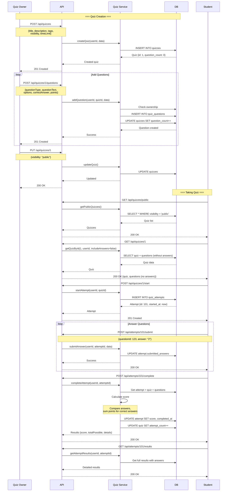
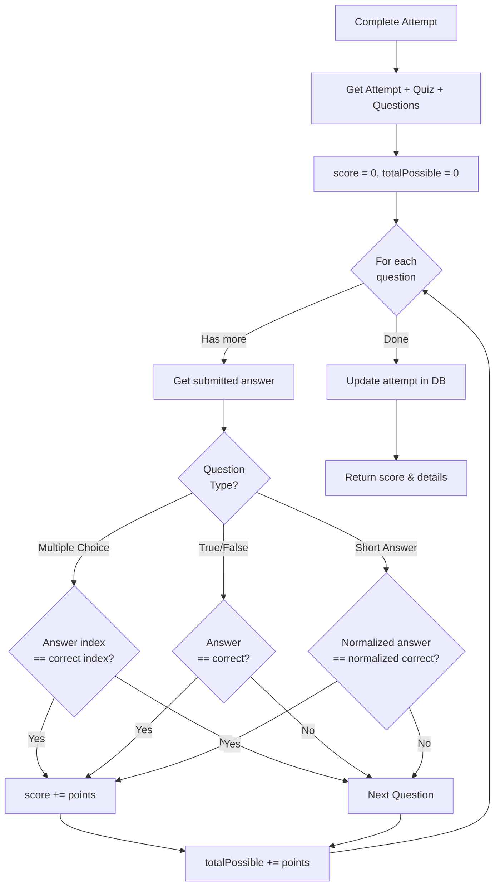

# Quiz System - Interactive Learning & Assessment

## Table of Contents
1. [Overview](#overview)
2. [Core Concepts](#core-concepts)
3. [Database Schema](#database-schema)
4. [API Endpoints](#api-endpoints)
5. [Flow Diagrams](#flow-diagrams)
6. [Implementation Details](#implementation-details)
7. [Scoring & Evaluation](#scoring--evaluation)

---

## Overview

Hệ thống **Quiz** cho phép người dùng tạo, chia sẻ và làm bài quiz để tự kiểm tra kiến thức. Hỗ trợ nhiều loại câu hỏi và tự động chấm điểm.

### Key Features

- ✅ **Quiz Creation**: Tạo quiz với nhiều câu hỏi
- ✅ **Multiple Question Types**: Hỗ trợ nhiều loại câu hỏi (multiple choice, true/false, short answer)
- ✅ **Time Limits**: Giới hạn thời gian làm bài (optional)
- ✅ **Auto-Grading**: Tự động chấm điểm
- ✅ **Visibility Control**: Public/Private/Friends-only
- ✅ **Attempt Tracking**: Theo dõi lịch sử làm bài
- ✅ **Result Analysis**: Phân tích kết quả chi tiết
- ✅ **Tags & Categories**: Phân loại theo môn học/chủ đề

---

## Core Concepts

### 1. Quiz

Một bộ câu hỏi với các thuộc tính:
- **Title & Description**: Tiêu đề và mô tả
- **Visibility**: `public`, `private`, `friends`
- **Time Limit**: Giới hạn thời gian (seconds, nullable)
- **Tags**: Array of tags để phân loại
- **Owner**: Người tạo quiz

### 2. Quiz Question

Mỗi câu hỏi trong quiz có:
- **Type**: `multiple_choice`, `true_false`, `short_answer`
- **Question Text**: Nội dung câu hỏi
- **Options**: Array of options (for multiple choice)
- **Correct Answer**: Đáp án đúng
- **Explanation**: Giải thích (optional)
- **Points**: Điểm của câu hỏi

### 3. Quiz Attempt

Mỗi lần làm bài được ghi lại:
- **User**: Người làm bài
- **Start Time**: Thời gian bắt đầu
- **End Time**: Thời gian kết thúc
- **Submitted Answers**: JSON object chứa câu trả lời
- **Score**: Điểm đạt được
- **Total Possible**: Tổng điểm tối đa

---

## Database Schema

### Quizzes Table

```sql
CREATE TABLE quizzes (
  id SERIAL PRIMARY KEY,
  owner_id INTEGER NOT NULL,
  title VARCHAR(255) NOT NULL,
  description TEXT,
  tags TEXT[] DEFAULT '{}',
  visibility VARCHAR(20) DEFAULT 'private',
  time_limit INTEGER,
  question_count INTEGER DEFAULT 0,
  attempt_count INTEGER DEFAULT 0,
  created_at TIMESTAMP DEFAULT NOW(),
  updated_at TIMESTAMP DEFAULT NOW(),
  deleted_at TIMESTAMP,
  FOREIGN KEY (owner_id) REFERENCES users(id) ON DELETE CASCADE
);

CREATE INDEX idx_quizzes_owner ON quizzes(owner_id);
CREATE INDEX idx_quizzes_visibility ON quizzes(visibility);
CREATE INDEX idx_quizzes_tags ON quizzes USING GIN(tags);
```

**Model:** [Quiz.js](file:///d:/STUDY/HUST/Subject/Web/hustudent/backend/models/Quiz.js)

**Visibility Options:**
- `public`: Ai cũng có thể xem và làm
- `private`: Chỉ owner xem được
- `friends`: Chỉ bạn bè xem được

### Quiz Questions Table

```sql
CREATE TABLE quiz_questions (
  id SERIAL PRIMARY KEY,
  quiz_id INTEGER NOT NULL,
  question_type VARCHAR(20) NOT NULL,
  question_text TEXT NOT NULL,
  options JSONB,
  correct_answer TEXT NOT NULL,
  explanation TEXT,
  points INTEGER DEFAULT 1,
  order_index INTEGER,
  created_at TIMESTAMP DEFAULT NOW(),
  FOREIGN KEY (quiz_id) REFERENCES quizzes(id) ON DELETE CASCADE
);

CREATE INDEX idx_quiz_questions_quiz_id ON quiz_questions(quiz_id);
```

**Model:** [QuizQuestion.js](file:///d:/STUDY/HUST/Subject/Web/hustudent/backend/models/QuizQuestion.js)

**Question Types:**
- `multiple_choice`: 1 đáp án đúng từ nhiều lựa chọn
- `true_false`: Đúng/Sai
- `short_answer`: Câu trả lời ngắn (text)

**Options Format (for multiple_choice):**
```json
[
  "Option A",
  "Option B",
  "Option C",
  "Option D"
]
```

**Correct Answer Format:**
- `multiple_choice`: Index của option (0, 1, 2, 3)
- `true_false`: "true" hoặc "false"
- `short_answer`: Đáp án mẫu (case-insensitive comparison)

### Quiz Attempts Table

```sql
CREATE TABLE quiz_attempts (
  id SERIAL PRIMARY KEY,
  quiz_id INTEGER NOT NULL,
  user_id INTEGER NOT NULL,
  started_at TIMESTAMP NOT NULL,
  completed_at TIMESTAMP,
  submitted_answers JSONB DEFAULT '{}',
  score INTEGER,
  total_possible INTEGER,
  created_at TIMESTAMP DEFAULT NOW(),
  FOREIGN KEY (quiz_id) REFERENCES quizzes(id) ON DELETE CASCADE,
  FOREIGN KEY (user_id) REFERENCES users(id) ON DELETE CASCADE
);

CREATE INDEX idx_quiz_attempts_user ON quiz_attempts(user_id);
CREATE INDEX idx_quiz_attempts_quiz ON quiz_attempts(quiz_id);
```

**Model:** [QuizAttempt.js](file:///d:/STUDY/HUST/Subject/Web/hustudent/backend/models/QuizAttempt.js)

**Submitted Answers Format:**
```json
{
  "123": "2",      // questionId: answer
  "124": "true",
  "125": "photosynthesis"
}
```

---

## API Endpoints

### Quiz Management Routes

| Method | Endpoint | Auth | Description |
|--------|----------|------|-------------|
| POST | `/api/quizzes` | ✅ | Tạo quiz mới |
| GET | `/api/quizzes` | ✅ | Lấy danh sách quiz của user |
| GET | `/api/quizzes/public` | ❌ | Lấy danh sách public quizzes |
| GET | `/api/quizzes/:id` | ✅ | Lấy thông tin quiz |
| PUT | `/api/quizzes/:id` | ✅ | Cập nhật quiz (owner only) |
| DELETE | `/api/quizzes/:id` | ✅ | Xóa quiz (owner only) |

### Question Management Routes

| Method | Endpoint | Auth | Description |
|--------|----------|------|-------------|
| POST | `/api/quizzes/:id/questions` | ✅ | Thêm câu hỏi vào quiz |
| PUT | `/api/questions/:id` | ✅ | Cập nhật câu hỏi |
| DELETE | `/api/questions/:id` | ✅ | Xóa câu hỏi |

### Quiz Taking Routes

| Method | Endpoint | Auth | Description |
|--------|----------|------|-------------|
| POST | `/api/quizzes/:id/start` | ✅ | Bắt đầu làm bài |
| POST | `/api/attempts/:id/submit` | ✅ | Nộp câu trả lời (1 câu/toàn bộ) |
| POST | `/api/attempts/:id/complete` | ✅ | Kết thúc và chấm điểm |
| GET | `/api/attempts/:id/results` | ✅ | Xem kết quả chi tiết |
| GET | `/api/quizzes/:id/attempts` | ✅ | Xem lịch sử làm bài |

---

## Flow Diagrams

### Complete Quiz Flow



### Auto-Grading Flow



---

## Implementation Details

### 1. Create Quiz

**File:** [quizService.js:5-18](file:///d:/STUDY/HUST/Subject/Web/hustudent/backend/services/quizService.js#L5-L18)

```javascript
async createQuiz(userId, { title, description, tags, visibility, timeLimit }) {
  const quiz = await Quiz.create({
    owner_id: userId,
    title,
    description,
    tags: tags || [],
    visibility: visibility || 'private',
    time_limit: timeLimit,
    question_count: 0,
    attempt_count: 0
  });

  return quiz;
}
```

### 2. Add Question

**File:** [quizService.js:83-106](file:///d:/STUDY/HUST/Subject/Web/hustudent/backend/services/quizService.js#L83-L106)

```javascript
async addQuestion(userId, quizId, { questionType, questionText, options, correctAnswer, explanation, points }) {
  // Verify ownership
  const quiz = await Quiz.findByPk(quizId);
  if (!quiz) {
    throw new AppError(ErrorCodes.NOT_FOUND, 'Quiz not found');
  }
  if (quiz.owner_id !== userId) {
    throw new AppError(ErrorCodes.FORBIDDEN, 'Not the owner');
  }

  // Validate question type
  const validTypes = ['multiple_choice', 'true_false', 'short_answer'];
  if (!validTypes.includes(questionType)) {
    throw new AppError(ErrorCodes.VALIDATION_ERROR, 'Invalid question type');
  }

  // Create question
  const question = await QuizQuestion.create({
    quiz_id: quizId,
    question_type: questionType,
    question_text: questionText,
    options: questionType === 'multiple_choice' ? options : null,
    correct_answer: correctAnswer.toString(),
    explanation,
    points: points || 1
  });

  // Update question count
  await quiz.increment('question_count');

  return question;
}
```

### 3. Start Attempt

**File:** [quizService.js:131-151](file:///d:/STUDY/HUST/Subject/Web/hustudent/backend/services/quizService.js#L131-L151)

```javascript
async startAttempt(userId, quizId) {
  const quiz = await Quiz.findByPk(quizId);
  if (!quiz || quiz.deleted_at) {
    throw new AppError(ErrorCodes.NOT_FOUND, 'Quiz not found');
  }

  // Check visibility
  if (quiz.visibility === 'private' && quiz.owner_id !== userId) {
    throw new AppError(ErrorCodes.FORBIDDEN, 'Quiz is private');
  }

  // Create attempt
  const attempt = await QuizAttempt.create({
    quiz_id: quizId,
    user_id: userId,
    started_at: new Date(),
    submitted_answers: {},
    score: null,
    total_possible: null
  });

  return attempt;
}
```

### 4. Submit Answer

**File:** [quizService.js:153-164](file:///d:/STUDY/HUST/Subject/Web/hustudent/backend/services/quizService.js#L153-L164)

```javascript
async submitAnswer(userId, attemptId, { questionId, answer }) {
  const attempt = await QuizAttempt.findByPk(attemptId);
  if (!attempt || attempt.user_id !== userId) {
    throw new AppError(ErrorCodes.FORBIDDEN, 'Not your attempt');
  }

  // Update submitted answers
  const answers = attempt.submitted_answers || {};
  answers[questionId] = answer;
  await attempt.update({ submitted_answers: answers });

  return { success: true };
}
```

### 5. Complete Attempt & Auto-Grade

**File:** [quizService.js:166-197](file:///d:/STUDY/HUST/Subject/Web/hustudent/backend/services/quizService.js#L166-L197)

```javascript
async completeAttempt(userId, attemptId) {
  const attempt = await QuizAttempt.findByPk(attemptId);
  if (!attempt || attempt.user_id !== userId) {
    throw new AppError(ErrorCodes.FORBIDDEN, 'Not your attempt');
  }

  if (attempt.completed_at) {
    throw new AppError(ErrorCodes.VALIDATION_ERROR, 'Attempt already completed');
  }

  // Get quiz and questions
  const quiz = await Quiz.findByPk(attempt.quiz_id);
  const questions = await QuizQuestion.findAll({
    where: { quiz_id: quiz.id },
    order: [['order_index', 'ASC']]
  });

  // Calculate score
  let score = 0;
  let totalPossible = 0;
  const submittedAnswers = attempt.submitted_answers || {};

  // Helper function for case-insensitive comparison
  const isEqual = (a, b) => {
    return a.toString().toLowerCase().trim() === b.toString().toLowerCase().trim();
  };

  questions.forEach(q => {
    totalPossible += q.points;
    const userAnswer = submittedAnswers[q.id];

    if (userAnswer !== undefined && userAnswer !== null) {
      // Check if answer is correct
      if (isEqual(userAnswer, q.correct_answer)) {
        score += q.points;
      }
    }
  });

  // Update attempt
  await attempt.update({
    completed_at: new Date(),
    score,
    total_possible: totalPossible
  });

  // Increment attempt count
  await quiz.increment('attempt_count');

  return {
    score,
    totalPossible,
    percentage: Math.round((score / totalPossible) * 100)
  };
}
```

### 6. Get Attempt Results

**File:** [quizService.js:199-231](file:///d:/STUDY/HUST/Subject/Web/hustudent/backend/services/quizService.js#L199-L231)

```javascript
async getAttemptResults(userId, attemptId) {
  const attempt = await QuizAttempt.findByPk(attemptId, {
    include: [
      {
        model: Quiz,
        as: 'quiz',
        attributes: ['id', 'title', 'owner_id']
      }
    ]
  });

  if (!attempt) {
    throw new AppError(ErrorCodes.NOT_FOUND, 'Attempt not found');
  }

  // Only owner or quiz creator can see results
  if (attempt.user_id !== userId && attempt.quiz.owner_id !== userId) {
    throw new AppError(ErrorCodes.FORBIDDEN, 'Cannot view this attempt');
  }

  // Get questions with answers
  const questions = await QuizQuestion.findAll({
    where: { quiz_id: attempt.quiz_id },
    order: [['order_index', 'ASC']]
  });

  const submittedAnswers = attempt.submitted_answers || {};

  // Build detailed results
  const questionResults = questions.map(q => {
    const userAnswer = submittedAnswers[q.id];
    const isCorrect = userAnswer && 
      userAnswer.toString().toLowerCase().trim() === 
      q.correct_answer.toString().toLowerCase().trim();

    return {
      questionId: q.id,
      questionText: q.question_text,
      questionType: q.question_type,
      options: q.options,
      userAnswer,
      correctAnswer: q.correct_answer,
      isCorrect,
      points: isCorrect ? q.points : 0,
      maxPoints: q.points,
      explanation: q.explanation
    };
  });

  return {
    attempt: {
      id: attempt.id,
      started_at: attempt.started_at,
      completed_at: attempt.completed_at,
      score: attempt.score,
      total_possible: attempt.total_possible,
      percentage: Math.round((attempt.score / attempt.total_possible) * 100)
    },
    quiz: {
      id: attempt.quiz.id,
      title: attempt.quiz.title
    },
    questions: questionResults
  };
}
```

---

## Request/Response Examples

### 1. Create Quiz

**Request:**
```http
POST /api/quizzes
Cookie: token=...
Content-Type: application/json

{
  "title": "Data Structures Basics",
  "description": "Test your knowledge on arrays, stacks, and queues",
  "tags": ["IT3103", "data-structures", "beginner"],
  "visibility": "public",
  "timeLimit": 1800
}
```

**Response (201 Created):**
```json
{
  "data": {
    "id": 1,
    "owner_id": 42,
    "title": "Data Structures Basics",
    "description": "Test your knowledge on arrays...",
    "tags": ["IT3103", "data-structures", "beginner"],
    "visibility": "public",
    "time_limit": 1800,
    "question_count": 0,
    "attempt_count": 0,
    "created_at": "2024-12-26T07:00:00.000Z"
  }
}
```

### 2. Add Question

**Request:**
```http
POST /api/quizzes/1/questions
Cookie: token=...
Content-Type: application/json

{
  "questionType": "multiple_choice",
  "questionText": "What is the time complexity of searching in a sorted array using binary search?",
  "options": [
    "O(n)",
    "O(log n)",
    "O(n log n)",
    "O(1)"
  ],
  "correctAnswer": "1",
  "explanation": "Binary search divides the search space in half each iteration, resulting in O(log n) complexity.",
  "points": 2
}
```

**Response (201 Created):**
```json
{
  "data": {
    "id": 123,
    "quiz_id": 1,
    "question_type": "multiple_choice",
    "question_text": "What is the time complexity...",
    "options": ["O(n)", "O(log n)", "O(n log n)", "O(1)"],
    "points": 2,
    "created_at": "2024-12-26T07:05:00.000Z"
  }
}
```

### 3. Start Attempt

**Request:**
```http
POST /api/quizzes/1/start
Cookie: token=...
```

**Response (201 Created):**
```json
{
  "data": {
    "id": 501,
    "quiz_id": 1,
    "user_id": 73,
    "started_at": "2024-12-26T08:00:00.000Z",
    "submitted_answers": {},
    "timeLimit": 1800
  }
}
```

### 4. Get Quiz (for taking)

**Request:**
```http
GET /api/quizzes/1
Cookie: token=...
```

**Response (200 OK):**
```json
{
  "data": {
    "quiz": {
      "id": 1,
      "title": "Data Structures Basics",
      "description": "Test your knowledge...",
      "time_limit": 1800,
      "question_count": 10
    },
    "questions": [
      {
        "id": 123,
        "question_type": "multiple_choice",
        "question_text": "What is the time complexity...",
        "options": ["O(n)", "O(log n)", "O(n log n)", "O(1)"],
        "points": 2
        // Note: NO correctAnswer field (hidden until completed)
      },
      {
        "id": 124,
        "question_type": "true_false",
        "question_text": "A stack follows FIFO principle.",
        "points": 1
      }
    ]
  }
}
```

### 5. Submit Answer

**Request:**
```http
POST /api/attempts/501/submit
Cookie: token=...
Content-Type: application/json

{
  "questionId": 123,
  "answer": "1"
}
```

**Response (200 OK):**
```json
{
  "data": {
    "success": true
  }
}
```

### 6. Complete Attempt

**Request:**
```http
POST /api/attempts/501/complete
Cookie: token=...
```

**Response (200 OK):**
```json
{
  "data": {
    "score": 16,
    "totalPossible": 20,
    "percentage": 80
  }
}
```

### 7. Get Results

**Request:**
```http
GET /api/attempts/501/results
Cookie: token=...
```

**Response (200 OK):**
```json
{
  "data": {
    "attempt": {
      "id": 501,
      "started_at": "2024-12-26T08:00:00.000Z",
      "completed_at": "2024-12-26T08:22:15.000Z",
      "score": 16,
      "total_possible": 20,
      "percentage": 80
    },
    "quiz": {
      "id": 1,
      "title": "Data Structures Basics"
    },
    "questions": [
      {
        "questionId": 123,
        "questionText": "What is the time complexity...",
        "questionType": "multiple_choice",
        "options": ["O(n)", "O(log n)", "O(n log n)", "O(1)"],
        "userAnswer": "1",
        "correctAnswer": "1",
        "isCorrect": true,
        "points": 2,
        "maxPoints": 2,
        "explanation": "Binary search divides..."
      },
      {
        "questionId": 124,
        "questionText": "A stack follows FIFO principle.",
        "questionType": "true_false",
        "userAnswer": "false",
        "correctAnswer": "false",
        "isCorrect": true,
        "points": 1,
        "maxPoints": 1,
        "explanation": "Stacks follow LIFO (Last In First Out)."
      },
      {
        "questionId": 125,
        "questionText": "What does DFS stand for?",
        "questionType": "short_answer",
        "userAnswer": "depth first search",
        "correctAnswer": "Depth First Search",
        "isCorrect": true,
        "points": 1,
        "maxPoints": 1,
        "explanation": null
      }
    ]
  }
}
```

---

## Scoring & Evaluation

### Answer Comparison Logic

#### Multiple Choice
```javascript
// Exact match on option index
const isCorrect = userAnswer === correctAnswer;
// Example: "1" === "1" ✓
```

#### True/False
```javascript
// Case-insensitive string comparison
const isCorrect = userAnswer.toLowerCase() === correctAnswer.toLowerCase();
// Example: "True" === "true" ✓
```

#### Short Answer
```javascript
// Normalized comparison (case-insensitive, trimmed)
const normalize = (str) => str.toString().toLowerCase().trim();
const isCorrect = normalize(userAnswer) === normalize(correctAnswer);

// Examples:
// "  Depth First Search  " === "depth first search" ✓
// "DFS" === "Depth First Search" ✗
```

### Percentage Calculation

```javascript
const percentage = Math.round((score / totalPossible) * 100);

// Examples:
// 16/20 = 80%
// 7/10 = 70%
// 9/10 = 90%
```

### Grade Ranges (Optional Frontend Implementation)

```javascript
const getGrade = (percentage) => {
  if (percentage >= 90) return 'A';
  if (percentage >= 80) return 'B';
  if (percentage >= 70) return 'C';
  if (percentage >= 60) return 'D';
  return 'F';
};
```

---

## Best Practices

### 1. Quiz Creation
- ✅ Minimum 5 questions per quiz
- ✅ Mix question types for variety
- ✅ Provide explanations for learning
- ✅ Set reasonable time limits (1-2 mins per question)
- ✅ Use clear, unambiguous question text

### 2. Question Design
- ✅ **Multiple Choice**: 4 options, 1 correct
- ✅ **True/False**: Simple factual statements
- ✅ **Short Answer**: Accept multiple valid formats
- ✅ Assign appropriate points (harder = more points)

### 3. Answer Flexibility
```javascript
// For short answers, consider accepting variations:
const acceptedAnswers = [
  "Depth First Search",
  "DFS",
  "depth-first search"
];

// Or use fuzzy matching (Levenshtein distance)
const isSimilar = (answer, correct, threshold = 0.8) => {
  const similarity = stringSimilarity(answer, correct);
  return similarity >= threshold;
};
```

### 4. Time Limits
- Short quizzes (5-10 questions): 10-15 minutes
- Medium quizzes (10-20 questions): 20-30 minutes
- Long quizzes (20+ questions): 45-60 minutes
- Practice mode: No time limit

### 5. Privacy
- Use `private` for drafts
- Use `friends` for study groups
- Use `public` for sharing with community

---

## Future Enhancements

### 1. Advanced Question Types
- Multiple correct answers
- Fill in the blank
- Matching questions
- Essay questions (manual grading)
- Code evaluation questions

### 2. Analytics
- Question difficulty analysis
- Most missed questions
- Average scores per quiz
- Time spent per question

### 3. Gamification
- Badges for achievements
- Leaderboards
- Streak tracking
- Points and rewards

### 4. Collaborative Features
- Shared quiz creation
- Quiz recommendations
- Comment on questions
- Report incorrect answers

### 5. Adaptive Learning
- Difficulty adjustment based on performance
- Personalized quiz generation
- Spaced repetition integration

---

## Related Files

### Backend Structure
```
backend/
├── controllers/
│   └── quizController.js          # HTTP handlers
├── services/
│   └── quizService.js             # Business logic & grading
├── models/
│   ├── Quiz.js                    # Quiz model
│   ├── QuizQuestion.js            # Question model
│   └── QuizAttempt.js             # Attempt model
└── routes/
    └── quizRoutes.js              # Route definitions
```

---

## References

- Related Documentation:
  - [Authentication Flow](file:///d:/STUDY/HUST/Subject/Web/hustudent/docs/AUTHENTICATION_FLOW.md)
  - [Study Matching Flow](file:///d:/STUDY/HUST/Subject/Web/hustudent/docs/STUDY_MATCHING_FLOW.md)
  - [Security Guide](file:///d:/STUDY/HUST/Subject/Web/hustudent/docs/SECURITY.md)
