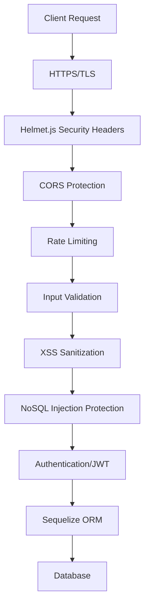

# Security Guide - HUStudent Application

This document outlines the security measures implemented in the HUStudent application and best practices for maintaining a secure application.

## Table of Contents

- [Security Architecture](#security-architecture)
- [Implemented Security Measures](#implemented-security-measures)
- [Authentication & Authorization](#authentication--authorization)
- [Database Security](#database-security)
- [Input Validation & Sanitization](#input-validation--sanitization)
- [Security Headers](#security-headers)
- [Rate Limiting](#rate-limiting)
- [Frontend Security](#frontend-security)
- [Security Best Practices](#security-best-practices)
- [Security Checklist](#security-checklist)
- [Reporting Security Vulnerabilities](#reporting-security-vulnerabilities)

---

## Security Architecture

The HUStudent application implements defense-in-depth security with multiple layers of protection:



---

## Implemented Security Measures

### ✅ Protection Against Common Vulnerabilities

| Vulnerability | Protection Status | Implementation |
|--------------|------------------|----------------|
| **SQL Injection** | ✅ Protected | Sequelize ORM with parameterized queries |
| **XSS (Cross-Site Scripting)** | ✅ Protected | Input sanitization + CSP headers + DOMPurify |
| **CSRF (Cross-Site Request Forgery)** | ⚠️ Partial | SameSite cookies (recommended: add CSRF tokens) |
| **NoSQL Injection** | ✅ Protected | express-mongo-sanitize middleware |
| **Clickjacking** | ✅ Protected | X-Frame-Options: DENY |
| **MIME Sniffing** | ✅ Protected | X-Content-Type-Options: nosniff |
| **Brute Force** | ✅ Protected | Rate limiting on auth endpoints |
| **Session Hijacking** | ✅ Protected | HTTP-only, Secure cookies |
| **Man-in-the-Middle** | ✅ Protected | HSTS header in production |

---

## Authentication & Authorization

### JWT Token-Based Authentication

**Implementation:**
- Access tokens stored in HTTP-only cookies
- Token expiration: 1 hour
- Tokens include user ID and type
- Secure cookie settings:
  - `httpOnly: true` - Prevents JavaScript access
  - `secure: true` (production) - HTTPS only
  - `sameSite: 'strict'` (production) - CSRF protection

**Cookie Configuration:**
```javascript
res.cookie('token', accessToken, {
  httpOnly: true,
  secure: process.env.NODE_ENV === 'production',
  sameSite: process.env.NODE_ENV === 'production' ? 'strict' : 'lax',
  maxAge: 60 * 60 * 1000, // 1 hour
  path: '/'
});
```

### Password Security

- **Hashing Algorithm:** bcrypt with salt rounds
- **Minimum Password Length:** 6 characters
- **Password Validation:** Basic requirements (can be enhanced)
- **Storage:** Only password hashes stored, never plain text

### Authentication Middleware

Location: `backend/middleware/auth.js`

```javascript
// Protect routes requiring authentication
router.get('/protected', authenticate, controller.method);

// Optional authentication (doesn't fail if no token)
router.get('/public', optionalAuth, controller.method);
```

---

## Database Security

### SQL Injection Protection

**Primary Defense: Sequelize ORM**

✅ **Safe (Parameterized Queries):**
```javascript
// Sequelize automatically parameterizes
const user = await User.findOne({ where: { email: userInput } });
```

⚠️ **Raw Queries (Use with caution):**
```javascript
// CORRECT - Use replacements
await sequelize.query(
  'SELECT * FROM users WHERE id = :userId',
  { replacements: { userId: id } }
);

// WRONG - Never do this!
await sequelize.query(`SELECT * FROM users WHERE id = ${id}`);
```

**Current Raw Queries:**
- `flashcardService.js` line 183-193: ✅ Uses parameterization correctly

### Database Connection Security

```javascript
// Production SSL configuration
dialectOptions: {
  ssl: env.NODE_ENV === 'production' ? {
    require: true,
    rejectUnauthorized: false
  } : false
}
```

---

## Input Validation & Sanitization

### Backend Validation

**Middleware:** `backend/middleware/security.js`

**Validation Functions:**

```javascript
import { 
  validateEmail, 
  validatePassword,
  validateString,
  handleValidationErrors 
} from '../middleware/security.js';

// Apply to routes
router.post('/endpoint',
  validateEmail(),
  validatePassword(),
  handleValidationErrors,
  controller.method
);
```

**Available Validators:**
- `validateEmail()` - Email format validation
- `validatePassword(field)` - Password strength validation
- `validatePasswordSimple(field)` - Basic password validation
- `validateName(field)` - Name validation (2-100 chars, letters only)
- `validateId(paramName)` - Integer ID validation
- `validateUUID(paramName)` - UUID validation
- `validateString(field, min, max)` - String length validation
- `validatePagination()` - Page and limit validation
- `validateSearchQuery()` - Search query validation

### XSS Protection

**Backend Sanitization:**

```javascript
// Automatic sanitization middleware
app.use(sanitizeAll);

// Removes:
// - <script> tags
// - Event handlers (onclick, onerror, etc.)
// - javascript: protocol
```

**NoSQL Injection Protection:**

```javascript
// Sanitizes $ and . in user input
app.use(sanitizeNoSQL);
```

### Frontend Sanitization

**Library:** `isomorphic-dompurify`  
**Location:** `frontend/src/lib/sanitize.js`

**Usage Examples:**

```javascript
import { 
  sanitizeHtml, 
  sanitizeText, 
  sanitizeUserInput,
  createSafeHtml 
} from '../lib/sanitize';

// Plain text (removes all HTML)
const cleanText = sanitizeText(userInput);

// User input for display (escapes HTML entities)
const safeName = sanitizeUserInput(userName);

// Rich text (allows safe HTML tags)
const safeHtml = sanitizeHtml(richContent);

// For React dangerouslySetInnerHTML
<div dangerouslySetInnerHTML={createSafeHtml(htmlContent)} />
```

**Important:** Always sanitize user-generated content before displaying:
- Chat messages
- Post content
- Comments
- User names and bios
- Group descriptions

---

## Security Headers

**Implementation:** Helmet.js in `backend/app.js`

### Content Security Policy (CSP)

Prevents XSS by controlling resource loading:

```javascript
contentSecurityPolicy: {
  directives: {
    defaultSrc: ["'self'"],
    styleSrc: ["'self'", "'unsafe-inline'"],
    scriptSrc: ["'self'"],
    imgSrc: ["'self'", "data:", "https:", "blob:"],
    connectSrc: ["'self'"],
    fontSrc: ["'self'"],
    objectSrc: ["'none'"],
    mediaSrc: ["'self'"],
    frameSrc: ["'none'"],
  }
}
```

### Other Security Headers

| Header | Value | Purpose |
|--------|-------|---------|
| `X-Frame-Options` | DENY | Prevents clickjacking |
| `X-Content-Type-Options` | nosniff | Prevents MIME sniffing |
| `X-XSS-Protection` | 1; mode=block | Legacy browser XSS protection |
| `Strict-Transport-Security` | max-age=31536000 | Forces HTTPS (production) |

### Verify Security Headers

```bash
# Check your deployed API
curl -I https://your-api-url/api/health

# Look for these headers:
# X-Content-Type-Options: nosniff
# X-Frame-Options: DENY
# Strict-Transport-Security: max-age=31536000; includeSubDomains; preload
```

---

## Rate Limiting

**Purpose:** Prevent brute force attacks and API abuse

### Rate Limit Configurations

| Endpoint Type | Limit | Window | File |
|--------------|-------|--------|------|
| General API | 2000 requests | 15 min | `app.js` |
| Login | 5 attempts | 15 min | `rateLimits.js` |
| Registration | 3 attempts | 1 hour | `rateLimits.js` |
| Password Change | 3 attempts | 15 min | `rateLimits.js` |
| File Upload | 50 uploads | 15 min | `rateLimits.js` |
| Create Operations | 50 requests | 15 min | `rateLimits.js` |

### Usage

```javascript
import { loginLimiter, registerLimiter } from '../middleware/rateLimits.js';

router.post('/login', loginLimiter, controller.login);
router.post('/register', registerLimiter, controller.register);
```

### Response When Rate Limited

```json
{
  "error": {
    "code": "TOO_MANY_LOGIN_ATTEMPTS",
    "message": "Too many login attempts. Please try again after 15 minutes."
  }
}
```

---

## Frontend Security

### XSS Prevention

**Never use:**
```javascript
// ❌ DANGEROUS
element.innerHTML = userInput;
<div dangerouslySetInnerHTML={{__html: userInput}} />
```

**Always sanitize:**
```javascript
// ✅ SAFE
import { sanitizeHtml } from '../lib/sanitize';
const safeContent = sanitizeHtml(userInput);
<div dangerouslySetInnerHTML={{__html: safeContent}} />
```

### HTTPS/Secure Communication

- **Production:** Always use HTTPS
- **Development:** HTTP allowed for localhost
- **Cookie Security:** Secure flag enabled in production

### Client-Side Validation

- Validate all user inputs before sending to API
- Display helpful error messages
- Never rely solely on client-side validation (always validate on server)

---

## Security Best Practices

### For Developers

1. **Never Trust User Input**
   - Always validate and sanitize on the backend
   - Use validation middleware for all routes
   - Sanitize before storing in database
   - Sanitize before displaying to users

2. **Keep Dependencies Updated**
   ```bash
   # Check for vulnerabilities
   npm audit
   
   # Fix vulnerabilities
   npm audit fix
   
   # Update packages
   npm update
   ```

3. **Environment Variables**
   - Never commit `.env` files
   - Use different secrets for dev/prod
   - Rotate secrets periodically
   - Use strong, random values

4. **Error Handling**
   - Don't expose stack traces in production
   - Log errors securely
   - Return generic error messages to users
   - Include error codes for debugging

5. **Database Security**
   - Use ORM (Sequelize) for queries
   - Always parameterize raw SQL queries
   - Use database user with minimum required privileges
   - Enable SSL for database connections in production

6. **File Uploads**
   - Validate file types and sizes
   - Scan uploaded files for malware (if possible)
   - Store files outside web root
   - Use content-disposition headers

### For Deployment

1. **HTTPS/TLS**
   - Always use HTTPS in production
   - Use valid SSL certificates
   - Enable HSTS header
   - Redirect HTTP to HTTPS

2. **Environment Configuration**
   ```bash
   NODE_ENV=production
   JWT_SECRET=<strong-random-secret>
   DATABASE_URL=<secure-connection-string>
   FRONTEND_URL=https://your-domain.com
   ```

3. **Database Security**
   - Enable SSL connections
   - Use strong database passwords
   - Limit database user permissions
   - Regular backups

4. **Monitoring**
   - Set up error logging
   - Monitor rate limit hits
   - Track failed login attempts
   - Set up security alerts

---

## Security Checklist

### Pre-Deployment

- [ ] All dependencies updated (`npm audit` clean)
- [ ] Environment variables configured
- [ ] HTTPS enabled
- [ ] Database SSL enabled
- [ ] JWT_SECRET is strong and unique
- [ ] Rate limiting configured
- [ ] Security headers verified
- [ ] Error handling doesn't expose sensitive info
- [ ] File upload validation in place
- [ ] CORS configured for production domain

### Code Review

- [ ] No hardcoded secrets or passwords
- [ ] All user inputs validated
- [ ] All outputs sanitized
- [ ] SQL queries parameterized
- [ ] Authentication required for protected routes
- [ ] Authorization checks in place
- [ ] Proper error handling
- [ ] Logging doesn't expose sensitive data

### Testing

- [ ] Test with malicious inputs (XSS payloads)
- [ ] Test SQL injection attempts
- [ ] Test rate limiting
- [ ] Test authentication bypass attempts
- [ ] Verify security headers in browser
- [ ] Test CORS with different origins
- [ ] Test file upload with malicious files

---

## Reporting Security Vulnerabilities

If you discover a security vulnerability in the HUStudent application, please report it responsibly:

1. **Do Not** open a public GitHub issue
2. **Do** email the maintainers directly
3. **Include:**
   - Description of the vulnerability
   - Steps to reproduce
   - Potential impact
   - Suggested fix (if any)

We will respond as quickly as possible and work to address the issue.

---

## Additional Resources

### Security Tools

- **OWASP ZAP** - Web application security scanner
- **Burp Suite** - Security testing toolkit
- **npm audit** - Check for vulnerable dependencies
- **Snyk** - Security vulnerability scanning

### Learning Resources

- [OWASP Top 10](https://owasp.org/www-project-top-ten/) - Most critical web application security risks
- [Helmet.js Documentation](https://helmetjs.github.io/) - Security headers middleware
- [Express Security Best Practices](https://expressjs.com/en/advanced/best-practice-security.html)
- [Node.js Security Checklist](https://blog.risingstack.com/node-js-security-checklist/)

### Regular Security Tasks

**Weekly:**
- Review error logs
- Check for failed login attempts

**Monthly:**
- Run `npm audit`
- Update dependencies
- Review rate limit logs

**Quarterly:**
- Security code review
- Penetration testing
- Update security documentation

---

## Version History

| Version | Date | Changes |
|---------|------|---------|
| 1.0 | 2025-12-26 | Initial security implementation |

---

**Last Updated:** 2025-12-26  
**Maintained By:** HUStudent Development Team
