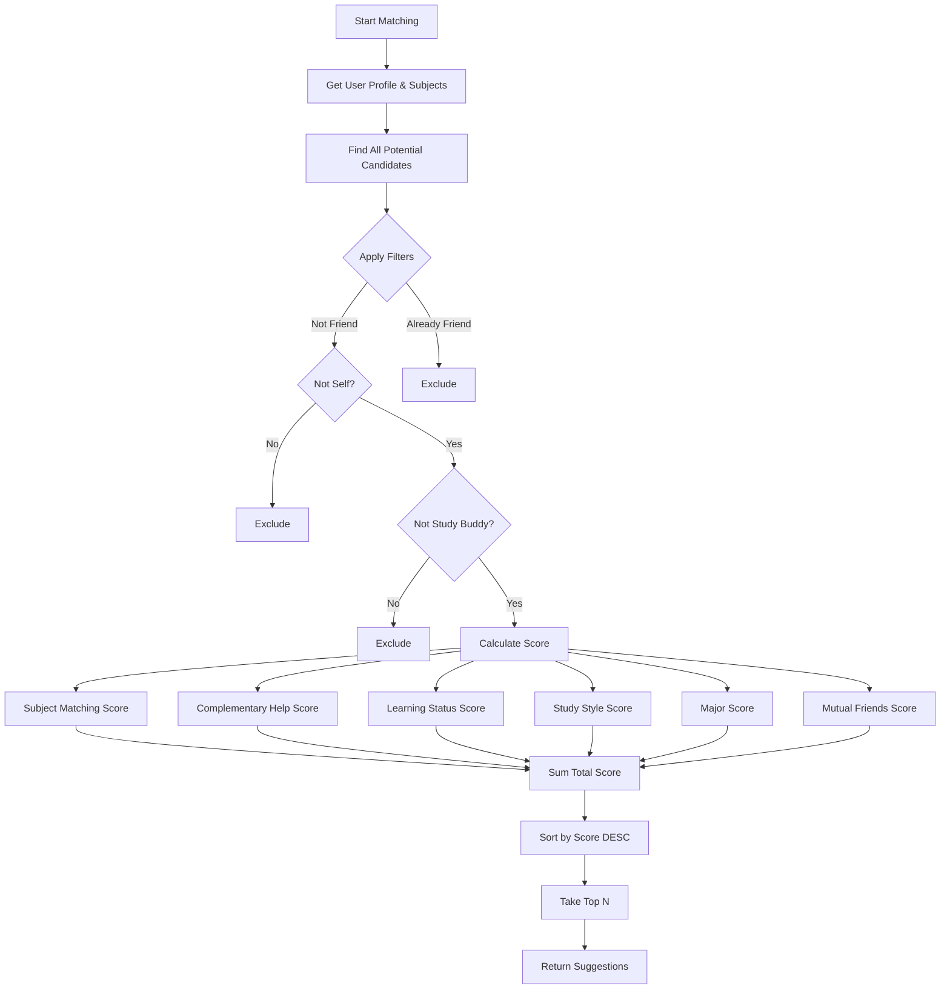
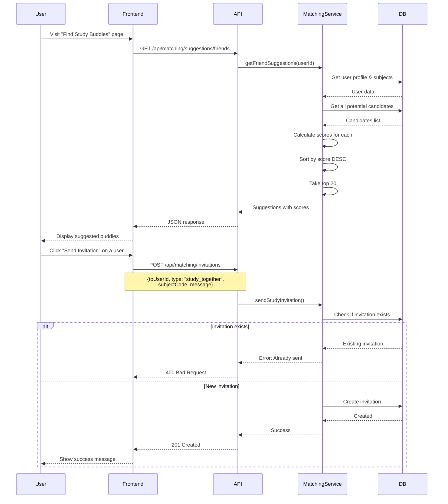
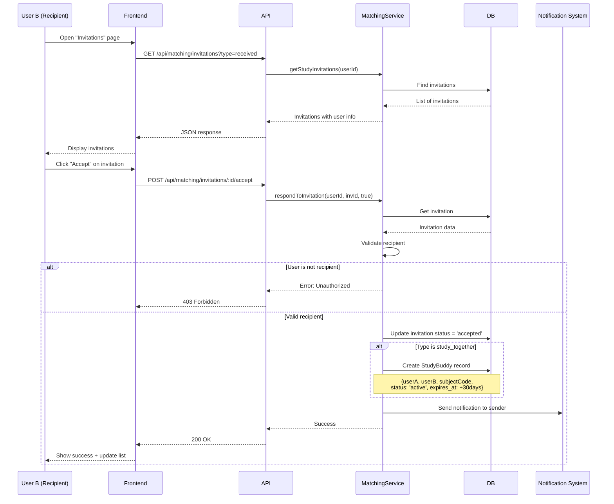
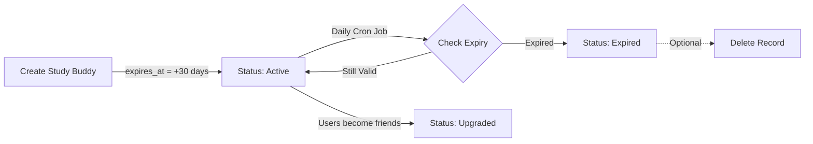

# Study Matching System - Tìm Bạn Học

## Table of Contents
1. [Overview](#overview)
2. [Core Concepts](#core-concepts)
3. [Database Schema](#database-schema)
4. [API Endpoints](#api-endpoints)
5. [Matching Algorithm](#matching-algorithm)
6. [Flow Diagrams](#flow-diagrams)
7. [Implementation Details](#implementation-details)

---

## Overview

Hệ thống **Study Matching** giúp sinh viên tìm kiếm và kết nối với các bạn học có cùng môn học, mục tiêu và phong cách học tập tương tự. Hệ thống sử dụng thuật toán scoring thông minh để đề xuất những người phù hợp nhất.

### Key Features

- ✅ **Study Profile Management**: Quản lý hồ sơ học tập cá nhân
- ✅ **Subject Tracking**: Theo dõi các môn học đang học/đã học
- ✅ **Smart Matching Algorithm**: Thuật toán tính điểm dựa trên nhiều yếu tố
- ✅ **Study Invitations**: Gửi/nhận lời mời học cùng
- ✅ **Study Buddy System**: Quản lý danh sách bạn học
- ✅ **Group Recommendations**: Đề xuất nhóm học phù hợp

---

## Core Concepts

### 1. Study Profile

Mỗi người dùng có một **Study Profile** chứa thông tin:
- Learning status (đang học môn gì)
- Study style (visual, auditory, reading/writing, kinesthetic)
- Học lực tự đánh giá (1-5 scale)
- Availability (thời gian rảnh)

### 2. User Subjects

Danh sách các môn học mà người dùng quan tâm, bao gồm:
- Môn học (Subject Code)
- Trình độ (beginner, intermediate, advanced, expert)
- Mục tiêu học tập
- Khả năng giúp đỡ người khác (canHelp)
- Cần được giúp đỡ (needsHelp)
- Học kỳ

### 3. Study Buddy

Khi hai người dùng chấp nhận lời mời học cùng, họ trở thành **Study Buddies** cho một môn học cụ thể.

### 4. Study Invitation

Lời mời học cùng có thể là:
- `study_together`: Học cùng một môn
- `join_group`: Mời tham gia nhóm học
- `study_session`: Mời tham gia buổi học

---

## Database Schema

### Study Profile Table

```sql
CREATE TABLE user_study_profiles (
  id SERIAL PRIMARY KEY,
  user_id INTEGER UNIQUE NOT NULL,
  learning_status VARCHAR(20) DEFAULT 'active',
  learning_status_subject VARCHAR(20),
  study_style VARCHAR(50),
  self_rated_level INTEGER CHECK (self_rated_level BETWEEN 1 AND 5),
  availability TEXT,
  created_at TIMESTAMP DEFAULT NOW(),
  updated_at TIMESTAMP DEFAULT NOW(),
  FOREIGN KEY (user_id) REFERENCES users(id) ON DELETE CASCADE,
  FOREIGN KEY (learning_status_subject) REFERENCES subjects(code)
);
```

**Model:** [UserStudyProfile.js](file:///d:/STUDY/HUST/Subject/Web/hustudent/backend/models/UserStudyProfile.js)

### User Subjects Table

```sql
CREATE TABLE user_subjects (
  id SERIAL PRIMARY KEY,
  user_id INTEGER NOT NULL,
  subject_code VARCHAR(20) NOT NULL,
  level VARCHAR(20) DEFAULT 'beginner',
  goals TEXT,
  can_help BOOLEAN DEFAULT FALSE,
  needs_help BOOLEAN DEFAULT FALSE,
  semester INTEGER,
  added_at TIMESTAMP DEFAULT NOW(),
  UNIQUE(user_id, subject_code),
  FOREIGN KEY (user_id) REFERENCES users(id) ON DELETE CASCADE,
  FOREIGN KEY (subject_code) REFERENCES subjects(code)
);
```

**Model:** [UserSubject.js](file:///d:/STUDY/HUST/Subject/Web/hustudent/backend/models/UserSubject.js)

### Study Buddies Table

```sql
CREATE TABLE study_buddies (
  id SERIAL PRIMARY KEY,
  user_a INTEGER NOT NULL,
  user_b INTEGER NOT NULL,
  subject_code VARCHAR(20),
  status VARCHAR(20) DEFAULT 'active',
  expires_at TIMESTAMP NOT NULL,
  created_at TIMESTAMP DEFAULT NOW(),
  UNIQUE(user_a, user_b, subject_code),
  FOREIGN KEY (user_a) REFERENCES users(id) ON DELETE CASCADE,
  FOREIGN KEY (user_b) REFERENCES users(id) ON DELETE CASCADE,
  FOREIGN KEY (subject_code) REFERENCES subjects(code)
);
```

**Model:** [StudyBuddy.js](file:///d:/STUDY/HUST/Subject/Web/hustudent/backend/models/StudyBuddy.js)

**Status Values:**
- `active`: Đang hoạt động
- `expired`: Đã hết hạn
- `upgraded`: Đã nâng cấp lên bạn bè thật sự

### Study Invitations Table

```sql
CREATE TABLE study_invitations (
  id SERIAL PRIMARY KEY,
  from_user_id INTEGER NOT NULL,
  to_user_id INTEGER NOT NULL,
  type VARCHAR(20) NOT NULL,
  target_id INTEGER,
  subject_code VARCHAR(20),
  message TEXT,
  status VARCHAR(20) DEFAULT 'pending',
  created_at TIMESTAMP DEFAULT NOW(),
  responded_at TIMESTAMP,
  FOREIGN KEY (from_user_id) REFERENCES users(id) ON DELETE CASCADE,
  FOREIGN KEY (to_user_id) REFERENCES users(id) ON DELETE CASCADE,
  FOREIGN KEY (subject_code) REFERENCES subjects(code)
);
```

**Model:** [StudyInvitation.js](file:///d:/STUDY/HUST/Subject/Web/hustudent/backend/models/StudyInvitation.js)

---

## API Endpoints

### Study Profile Routes

| Method | Endpoint | Auth | Description |
|--------|----------|------|-------------|
| GET | `/api/matching/profile` | ✅ | Lấy study profile của user |
| PUT | `/api/matching/profile` | ✅ | Cập nhật study profile |
| PATCH | `/api/matching/profile/learning-status` | ✅ | Cập nhật trạng thái đang học |

### User Subjects Routes

| Method | Endpoint | Auth | Description |
|--------|----------|------|-------------|
| GET | `/api/matching/subjects` | ✅ | Lấy danh sách môn học của user |
| POST | `/api/matching/subjects` | ✅ | Thêm môn học mới |
| PUT | `/api/matching/subjects/:code` | ✅ | Cập nhật môn học |
| DELETE | `/api/matching/subjects/:code` | ✅ | Xóa môn học |

### Matching & Suggestions Routes

| Method | Endpoint | Auth | Description |
|--------|----------|------|-------------|
| GET | `/api/matching/suggestions/friends` | ✅ | Lấy danh sách gợi ý bạn học |
| GET | `/api/matching/suggestions/groups` | ✅ | Lấy danh sách gợi ý nhóm |

### Study Invitations Routes

| Method | Endpoint | Auth | Description |
|--------|----------|------|-------------|
| POST | `/api/matching/invitations` | ✅ | Gửi lời mời học cùng |
| GET | `/api/matching/invitations` | ✅ | Lấy danh sách lời mời |
| POST | `/api/matching/invitations/:id/accept` | ✅ | Chấp nhận lời mời |
| POST | `/api/matching/invitations/:id/decline` | ✅ | Từ chối lời mời |

### Study Buddies Routes

| Method | Endpoint | Auth | Description |
|--------|----------|------|-------------|
| GET | `/api/matching/buddies` | ✅ | Lấy danh sách study buddies |

---

## Matching Algorithm

### Scoring System

Hệ thống tính điểm phù hợp dựa trên nhiều yếu tố với trọng số khác nhau:

```javascript
const weights = {
  commonSubjectsExact: 10,      // Cùng môn học & mức độ
  commonSubjectsAny: 5,          // Cùng môn học khác mức độ
  complementaryHelp: 8,          // Người này cần giúp, người kia có thể giúp
  sameLearningStatus: 3,         // Đang học cùng môn
  sameStudyStyle: 2,             // Cùng phong cách học
  sameMajor: 1,                  // Cùng chuyên ngành
  mutualFriends: 1               // Có bạn chung (per friend)
};
```

### Algorithm Flow



### Detailed Scoring Logic

#### 1. Subject Matching Score

```javascript
// Exact match: cùng môn + cùng level
if (subject.subjectCode === userSubject.subjectCode && 
    subject.level === userSubject.level) {
  score += 10;
}

// Any match: cùng môn khác level
else if (subject.subjectCode === userSubject.subjectCode) {
  score += 5;
}
```

#### 2. Complementary Help Score

```javascript
// User cần giúp môn A, candidate có thể giúp môn A
if (userSubject.needsHelp && candidateSubject.canHelp) {
  score += 8;
}

// User có thể giúp môn A, candidate cần giúp môn A
if (userSubject.canHelp && candidateSubject.needsHelp) {
  score += 8;
}
```

#### 3. Learning Status Score

```javascript
// Đang học cùng một môn
if (userProfile.learning_status_subject === candidateProfile.learning_status_subject) {
  score += 3;
}
```

#### 4. Study Style Score

```javascript
// Cùng phong cách học tập
if (userProfile.study_style === candidateProfile.study_style) {
  score += 2;
}
```

#### 5. Social Score

```javascript
// Mỗi bạn chung +1 điểm
const mutualFriends = countMutualFriends(userId, candidateId);
score += mutualFriends * 1;
```

---

## Flow Diagrams

### Complete Study Matching Flow



### Invitation Response Flow



### Study Buddy Expiration Flow



---

## Implementation Details

### 1. Get Friend Suggestions

**File:** [matchingService.js:113-220](file:///d:/STUDY/HUST/Subject/Web/hustudent/backend/services/matchingService.js#L113-L220)

```javascript
async getFriendSuggestions(userId, { limit = 20 } = {}) {
  // 1. Get user's profile and subjects
  const userProfile = await UserStudyProfile.findOne({ where: { user_id: userId } });
  const userSubjects = await UserSubject.findAll({ where: { user_id: userId } });
  
  // 2. Get existing relationships to exclude
  const friendships = await Friendship.findAll({
    where: {
      [Op.or]: [{ user_a: userId }, { user_b: userId }]
    }
  });
  
  const studyBuddies = await StudyBuddy.findAll({
    where: {
      [Op.or]: [{ user_a: userId }, { user_b: userId }],
      status: 'active'
    }
  });
  
  // 3. Build exclusion list
  const excludeIds = new Set([userId]);
  friendships.forEach(f => {
    excludeIds.add(f.user_a === userId ? f.user_b : f.user_a);
  });
  studyBuddies.forEach(b => {
    excludeIds.add(b.user_a === userId ? b.user_b : b.user_a);
  });
  
  // 4. Get ALL users (except excluded)
  const candidates = await User.findAll({
    where: {
      id: { [Op.notIn]: Array.from(excludeIds) },
      deleted_at: null
    },
    include: [
      { model: UserStudyProfile, as: 'studyProfile' },
      { model: UserSubject, as: 'subjects' }
    ]
  });
  
  // 5. Calculate score for each candidate
  const scored = candidates.map(candidate => {
    let score = 0;
    const reasons = [];
    
    // Subject matching
    userSubjects.forEach(us => {
      candidate.subjects.forEach(cs => {
        if (us.subject_code === cs.subject_code) {
          if (us.level === cs.level) {
            score += 10;
            reasons.push(`Same level in ${us.subject_code}`);
          } else {
            score += 5;
            reasons.push(`Learning ${us.subject_code}`);
          }
        }
        
        // Complementary help
        if (us.subject_code === cs.subject_code) {
          if (us.needs_help && cs.can_help) {
            score += 8;
            reasons.push(`Can help you with ${us.subject_code}`);
          }
          if (us.can_help && cs.needs_help) {
            score += 8;
            reasons.push(`Needs help with ${us.subject_code}`);
          }
        }
      });
    });
    
    // Learning status match
    if (userProfile && candidate.studyProfile) {
      if (userProfile.learning_status_subject === 
          candidate.studyProfile.learning_status_subject) {
        score += 3;
        reasons.push('Currently studying the same subject');
      }
      
      if (userProfile.study_style === candidate.studyProfile.study_style) {
        score += 2;
        reasons.push(`Same study style: ${userProfile.study_style}`);
      }
    }
    
    // Same major
    if (candidate.major === user.major) {
      score += 1;
      reasons.push('Same major');
    }
    
    return {
      user: candidate,
      score,
      reasons
    };
  });
  
  // 6. Sort and limit
  return scored
    .filter(s => s.score > 0)
    .sort((a, b) => b.score - a.score)
    .slice(0, limit);
}
```

### 2. Send Study Invitation

**File:** [matchingService.js:262-294](file:///d:/STUDY/HUST/Subject/Web/hustudent/backend/services/matchingService.js#L262-L294)

```javascript
async sendStudyInvitation(userId, { toUserId, type, targetId, subjectCode, message }) {
  // Validate type
  const validTypes = ['study_together', 'join_group', 'study_session'];
  if (!validTypes.includes(type)) {
    throw new AppError(ErrorCodes.VALIDATION_ERROR, 'Invalid invitation type');
  }
  
  // Check if already sent
  const existing = await StudyInvitation.findOne({
    where: {
      from_user_id: userId,
      to_user_id: toUserId,
      type,
      subject_code: subjectCode,
      status: 'pending'
    }
  });
  
  if (existing) {
    throw new AppError(ErrorCodes.CONFLICT, 'Invitation already sent');
  }
  
  // Create invitation
  const invitation = await StudyInvitation.create({
    from_user_id: userId,
    to_user_id: toUserId,
    type,
    target_id: targetId,
    subject_code: subjectCode,
    message,
    status: 'pending'
  });
  
  // TODO: Send notification to recipient
  
  return invitation;
}
```

### 3. Respond to Invitation

**File:** [matchingService.js:315-340](file:///d:/STUDY/HUST/Subject/Web/hustudent/backend/services/matchingService.js#L315-L340)

```javascript
async respondToInvitation(userId, invitationId, accept) {
  const invitation = await StudyInvitation.findByPk(invitationId);
  
  if (!invitation) {
    throw new AppError(ErrorCodes.NOT_FOUND, 'Invitation not found');
  }
  
  if (invitation.to_user_id !== userId) {
    throw new AppError(ErrorCodes.FORBIDDEN, 'Not your invitation');
  }
  
  if (invitation.status !== 'pending') {
    throw new AppError(ErrorCodes.VALIDATION_ERROR, 'Invitation already responded');
  }
  
  // Update invitation
  await invitation.update({
    status: accept ? 'accepted' : 'declined',
    responded_at: new Date()
  });
  
  // If accepted and type is study_together, create StudyBuddy
  if (accept && invitation.type === 'study_together') {
    const { userA, userB } = StudyBuddy.getOrderedIds(
      invitation.from_user_id,
      invitation.to_user_id
    );
    
    await StudyBuddy.create({
      user_a: userA,
      user_b: userB,
      subject_code: invitation.subject_code,
      status: 'active',
      expires_at: new Date(Date.now() + 30 * 24 * 60 * 60 * 1000) // 30 days
    });
  }
  
  return { invitation };
}
```

---

## Request/Response Examples

### 1. Get Friend Suggestions

**Request:**
```http
GET /api/matching/suggestions/friends?limit=10
Cookie: token=...
```

**Response (200 OK):**
```json
{
  "data": [
    {
      "user": {
        "id": 42,
        "full_name": "Trần Văn B",
        "avatar_url": "https://...",
        "major": "CNTT"
      },
      "score": 23,
      "reasons": [
        "Same level in IT3103",
        "Can help you with IT4785",
        "Currently studying the same subject",
        "Same study style: visual"
      ]
    },
    {
      "user": {
        "id": 73,
        "full_name": "Nguyễn Thị C",
        "avatar_url": null,
        "major": "CNTT"
      },
      "score": 15,
      "reasons": [
        "Learning IT3103",
        "Needs help with IT2030",
        "Same major"
      ]
    }
  ]
}
```

### 2. Send Invitation

**Request:**
```http
POST /api/matching/invitations
Cookie: token=...
Content-Type: application/json

{
  "toUserId": 42,
  "type": "study_together",
  "subjectCode": "IT3103",
  "message": "Hi! I see we're both learning Data Structures. Want to study together?"
}
```

**Response (201 Created):**
```json
{
  "data": {
    "id": 156,
    "from_user_id": 1,
    "to_user_id": 42,
    "type": "study_together",
    "subject_code": "IT3103",
    "message": "Hi! I see we're both learning...",
    "status": "pending",
    "created_at": "2024-12-26T07:00:00.000Z"
  }
}
```

### 3. Get Received Invitations

**Request:**
```http
GET /api/matching/invitations?type=received
Cookie: token=...
```

**Response (200 OK):**
```json
{
  "data": [
    {
      "id": 156,
      "type": "study_together",
      "subject_code": "IT3103",
      "message": "Hi! I see we're both learning...",
      "status": "pending",
      "created_at": "2024-12-26T07:00:00.000Z",
      "fromUser": {
        "id": 1,
        "full_name": "Nguyễn Văn A",
        "avatar_url": "https://..."
      },
      "subject": {
        "code": "IT3103",
        "name": "Cấu trúc dữ liệu và giải thuật"
      }
    }
  ]
}
```

### 4. Accept Invitation

**Request:**
```http
POST /api/matching/invitations/156/accept
Cookie: token=...
```

**Response (200 OK):**
```json
{
  "data": {
    "invitation": {
      "id": 156,
      "status": "accepted",
      "responded_at": "2024-12-26T07:30:00.000Z"
    }
  }
}
```

---

## Best Practices

### 1. Profile Completeness

Khuyến khích users điền đầy đủ study profile để tăng độ chính xác của matching:
- ✅ Thêm ít nhất 3 môn học
- ✅ Đánh dấu `canHelp` cho môn mạnh
- ✅ Đánh dấu `needsHelp` cho môn cần hỗ trợ
- ✅ Cập nhật learning status thường xuyên

### 2. Scoring Adjustments

Có thể điều chỉnh trọng số trong algorithm theo feedback của users:
```javascript
// Ví dụ: Tăng trọng số cho complementary help
const weights = {
  complementaryHelp: 12,  // Tăng từ 8 lên 12
  // ...
};
```

### 3. Expiration Management

Nên có cron job để:
- Xóa invitations cũ (> 7 days, status = pending)
- Update study buddies expired (> 30 days)
- Gửi reminder trước khi expire

### 4. Privacy Considerations

- Chỉ show suggestions cho users có profile công khai
- Cho phép users ẩn profile khỏi matching system
- Không show quá nhiều thông tin cá nhân trong suggestions

---

## Related Files

### Backend Structure
```
backend/
├── controllers/
│   └── matchingController.js       # HTTP handlers
├── services/
│   └── matchingService.js          # Business logic & algorithm
├── models/
│   ├── UserStudyProfile.js        # Study profile model
│   ├── UserSubject.js             # User subjects model
│   ├── StudyBuddy.js              # Study buddy model
│   └── StudyInvitation.js         # Invitation model
└── routes/
    └── matchingRoutes.js          # Route definitions
```

---

## Future Enhancements

### 1. Advanced Matching
- ML-based recommendations
- Time-based availability matching
- Location-based suggestions (for offline study)

### 2. Study Groups
- Auto-suggest optimal group compositions
- Group study sessions scheduling
- Collaborative learning tools

### 3. Gamification
- Study streaks with buddies
- Achievement badges
- Leaderboards

### 4. Analytics
- Track matching success rate
- Study buddy effectiveness metrics
- Popular subjects/times for study sessions

---

## References

- Related Documentation:
  - [Authentication Flow](file:///d:/STUDY/HUST/Subject/Web/hustudent/docs/AUTHENTICATION_FLOW.md)
  - [Security Guide](file:///d:/STUDY/HUST/Subject/Web/hustudent/docs/SECURITY.md)
